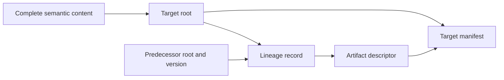

# Model Pack v2 format proposal

Status: proposed, 2026-09-05. This completes the format-proposal milestone in the
[Engine Roadmap](../ENGINE_ROADMAP.md); acceptance and runtime implementation are
subsequent milestones. Public builders, loaders, schemas, registry, cache, worker
protocol and released models still use v1. The draft schemas and examples here
are documentation assets, not supported Model Packs or release goldens.

## Purpose and decisions

Large models need bounded, independently checked downloads. A release also needs
to bind optional lineage without creating a self-referential hash. v2 separates
logical model content from its physical partition:

| Decision | Contract |
|---|---|
| Model identity | Hash the complete logical nodes, edges and dictionaries, compatibility and exact source. |
| Release identity | Additionally hash metadata, partition layout and optional file descriptors. |
| Chunk verification | Authenticate one chunk against an exact manifest and check its local record contract. |
| Complete analysis | Require every semantic chunk, global uniqueness, endpoint closure and recomputed logical hashes. |
| Optional files | Bind their profile, content and location into the manifest, outside the semantic root. |
| Lineage | Reuse the existing version-1 lineage record; attach it to its target release. |
| Compatibility | Explicit format dispatch; preserve all v1 bytes, hashes and rejection rules. |

A checked chunk proves that these records match a manifest declaration. It is
**not** a Merkle membership proof against the semantic root, a complete graph,
or evidence that an unloaded boundary has no edges. A pinned manifest can itself
contain inconsistent declarations; complete verification must detect that.

## Manifest and canonical representation

The [draft manifest schema](schema/manifest.schema.json) closes transport objects.
The [chunk schema](schema/chunk.schema.json) closes chunk envelopes while
preserving arbitrary canonical node and edge fields, as v1 does. JSON Schema
checks shape; the ordering, coverage, hashes and graph checks below are also
mandatory. Schema acceptance alone never verifies a pack.

The root directory contains `manifest.json` and only paths in `layout`:

```text
manifest.json
semantic/nodes/00000000.json
semantic/nodes/00000001.json
semantic/edges/00000000.json
semantic/dictionaries.json
indexes/by-id.json                 (optional)
artifacts/from-previous.json       (optional)
```

All v2 files use exactly the UTF-8 bytes of the existing kernel canonical JSON
policy, with no BOM, trailing newline or alternate whitespace. Decoding is fatal
on invalid UTF-8. Parse, canonicalize and compare the original decoded bytes
before using a file; duplicate keys, alternate numeric spellings and escaped
spellings that differ from the canonical output consequently fail. Nonfinite
numbers, unpaired surrogates and prototype-sensitive property keys fail under
the existing canonical policy. Sorting uses JavaScript UTF-16 code-unit order,
never locale order or Unicode normalization. Integers used as counts, offsets
or lengths must be safe; checked addition must reject overflow.

Model/source metadata and semantic record normalization retain v1 rules:
nonempty bounded strings; unique node/edge identifiers within each collection;
no `__proto__`, `constructor` or `prototype` identifiers; nodes sorted by `id`;
edges sorted by `id`, with `source` and `target` resolving to nodes. Nodes are
nonempty. Empty edges are valid. Dictionaries remain one canonical object,
including `{}`. Record identifiers are not required to be filesystem-safe.
All record fields remain semantic, including labels and provenance.

Metadata strings have the same runtime bounds as v1: 1,024 UTF-16 code units,
except the 4,096-unit description. Schema `maxLength` counts Unicode code points;
the runtime must additionally enforce the UTF-16 bounds, including identifiers
in independently checked chunks. Source files retain the exact `{path, hash}`
provenance contract, sorted by unique path; paths are relative, have no
backslashes, empty segments, `.` or `..` segments. Source paths are evidence
identifiers and are **never fetched** as pack transport locations. The optional
source audit hash remains part of semantic identity.

## Hash recipe

Let `C(value)` be the current kernel canonical UTF-8 JSON and define:

```text
H(domain, value) = "sha256:" + lowercaseHex(SHA256(
  UTF8("ONTO2D\0" + decimal(UTF8(domain).length) + "\0" + domain + "\0")
  || C(value)
))
```

This is the existing `hashCanonical` framing. Every domain below is distinct.
The complete normalized arrays, not arrays of physical chunk envelopes, enter
the logical collection hashes:

```js
nodesHash = H("onto2d:model-pack-collection:v2", { collection: "nodes", value: nodes });
edgesHash = H("onto2d:model-pack-collection:v2", { collection: "edges", value: edges });
dictionariesHash = H("onto2d:model-pack-collection:v2", {
  collection: "dictionaries", value: dictionaries
});
semantics = {
  nodes: { count: nodes.length, hash: nodesHash },
  edges: { count: edges.length, hash: edgesHash },
  dictionaries: { hash: dictionariesHash }
};
rootHash = H("onto2d:model-pack-root:v2", {
  format: "onto2d-model-pack", formatVersion: "2", schemaVersion: "2",
  modelId: model.id,
  compatibility: { engineApiVersion: "1", modelPackFormatVersion: "2" },
  source, semantics
});
manifestHash = H("onto2d:model-pack-manifest:v2", manifestWithoutManifestHash);
```

The complete manifest includes `model`, `source`, `compatibility`, `semantics`,
`layout`, `rootHash` and the two format/version fields plus `schemaVersion`.
There is no second statistics object that could disagree with collection counts.
`engineApiVersion: "1"` proposes retaining analysis semantics; it does not claim
that an existing engine or transport accepts format 2.

`model.id` enters the root. As in v1, model version/name/description/status are
manifest metadata; a metadata-only release may retain its root. An exact release
reference is `(formatVersion, model.id, model.version, rootHash, manifestHash)`.
Changing chunk boundaries, adding a lineage record, rebuilding or removing an
optional index preserves the root and changes the manifest. Changing any node,
edge, dictionary, source binding or compatibility field changes the root.
A v1-to-v2 repack has a new root even with identical logical records: the domains
and root recipe are different. Equal IDs or record arrays do not create a hash
alias between formats.

## Chunks and completeness

`layout.nodes` and `layout.edges` are ordered arrays of descriptors. Each has
`path`, `offset`, `count`, `firstId`, `lastId`, `byteLength` and `hash`.
The file at ordinal `i` must be named with the zero-padded eight-digit ordinal,
under its collection directory. This ordinal is not the record offset.

```js
chunk = { schemaVersion: "2", collection: "nodes", offset: 0, records: [{ id: "a" }] };
chunkHash = H("onto2d:model-pack-chunk:v2", chunk);
byteLength = C(chunk).length;
```

`byteLength` always measures decoded canonical UTF-8 file bytes, including the
envelope. It is neither HTTP compressed transfer size nor JS string length.
The dictionary descriptor uses the fixed path `semantic/dictionaries.json`,
`C(dictionaries).length` and `dictionariesHash` directly; its file contains the
object, without a chunk envelope.

Manifest checks, before requesting child files:

1. Validate the closed schema, canonical bytes and external expected identity.
   Recompute the manifest hash and the root recipe over the declared semantics.
2. Validate every path, unique descriptor identity and the aggregate limits.
   Require node/edge offsets to start at zero and exactly cover their declared
   counts without gaps, overlaps or overflow. Chunks must be nonempty. An empty
   edge collection has count zero and an empty descriptor array.
3. Require `firstId <= lastId` and strictly increasing, disjoint ID ranges between
   consecutive chunks. `count == 1` requires equal bounds; larger chunks require
   distinct bounds. These are declarations until the relevant data is checked.
4. Enforce ordinal paths. Sort indexes and artifacts by unique `id`; match each
   index ID to its fixed path and each artifact to `artifacts/<id>.json`.
   Reject unknown manifest fields, duplicate paths and undeclared files in a
   local directory/archive. There is no v2 `bundle.json` in this initial profile.

A chunk check uses the immutable, already checked manifest and its exact expected
release reference. Compare decoded length and hash, validate envelope version,
collection and offset, then check record count, schema, strict ID ordering and
exact first/last IDs. Edge endpoint strings are validated locally, but endpoint
existence is deferred. Never silently sort or repair a received chunk.

Complete semantic verification concatenates chunks in descriptor order, checks
global ordering/uniqueness, checks every edge endpoint, verifies dictionaries,
recomputes all three logical hashes and the root, and compares the original
manifest identity again. No missing chunk may be treated as an empty collection.
Rebuild the seven existing model indexes from the complete records. Each requested
optional index must equal that reconstruction before it can be used or reported
as verified. Core-only verification uses rebuilt indexes. The descriptor hash is
`H("onto2d:model-pack-index:v2", { id, value })`; paths retain the v1 index map.
Index files are optional accelerators, with zero to seven unique known IDs.

The initial builder may choose deterministic record-count batches, shrinking a
batch to meet its byte budget. Batch size is an operational option, outside the
root; oversized individual records fail explicitly. Chunking improves download,
cancellation and inspection granularity. Full engine analysis still needs the
complete population and current global graph/index memory. Do not promise
constant-memory analysis or bypass the kernel's canonical depth, entry or string
limits. A future streaming hash must reproduce the exact collection bytes above
and enforce explicit cumulative limits; hashing chunk hashes in their place is
incorrect. Root-only partial membership proofs and semantic subgraph analysis
are deferred to a separately reviewed contract.

## Optional artifacts and lineage

Artifact descriptors contain `id`, `profile`, `path`, `byteLength` and
`hash = H("onto2d:model-pack-artifact:v2", { profile, value })`. Their files are
inert canonical JSON values. Hash binding includes the profile, so changing an
interpretation cannot reuse the same descriptor hash. Unknown profiles may be
skipped or integrity-checked and reported as unsupported; they never execute
code, resolve URLs, register analyses or alter model semantics.

The first interpreted profile is `onto2d-model-lineage-v1`, using the existing
[lineage schema](../../packages/schemas/schemas/model-lineage.schema.json) and
[normalization/verifier](../../packages/engine/src/lineage.js). Keep its existing
`lineageHash`, event kinds, cardinality and canonical ordering. Do not invent a
second lineage format merely because the pack format changes.

Each record's `to` tuple must equal this manifest's model ID, version and root;
`from` must be a different tuple. Endpoints have no manifest hash or download URL.
Obtain both full endpoint packs through explicit release resolutions and check
their roots; never infer the pack format by parsing a digest. v1/v2 endpoints
are possible after both formats have supported full verification, with explicit
resolutions for each. The record cannot establish that different format roots
represent the same model. A conversion alone is not evidence of historical
continuity, and does not justify inventing a lineage event.

The hash dependency is acyclic:



Compute roots first, then lineage, its descriptor, and finally the target
manifest. Adding `manifestHash` to a lineage endpoint is forbidden by its closed
schema. Multiple lineage records may describe different predecessors; a caller
must explicitly select the record for comparison. No automatic `previous`
selection, chained downloads or merging of competing histories is introduced.

Artifact integrity and `to` binding do not validate a historical claim. Using
lineage for comparison additionally requires both fully verified endpoint models
and the existing event checks against their actual structural diff. Scientific
review remains separate. The synthetic rename example is not a second real
release of any published model.

## Verification states and failure behavior

Expose completeness and authority separately; a self-consistent manifest without
an independently supplied expected hash has `transport-only` authority. An exact
manifest pin, or an entry from an independently pinned registry, supplies
`hash-pinned` authority. Computing a hash from received data does not supply a pin.

| State | What a caller may do |
|---|---|
| `manifest-checked` | Inspect declared metadata and plan bounded requests. |
| `chunks-checked` | Inspect loaded records with coverage and unresolved endpoints visible. |
| `model-verified` | Use full semantic data and rebuilt indexes in the engine. |
| `release-verified` | Additionally attest that every declared optional file is present and integrity-checked, and every supported profile passed its local contract. |

Chunk receipts bind the exact release reference, collection, offset, count and
chunk hash. Partial state must be a separate type from an engine `Model`; it
cannot enter traversal, diff, analysis or the existing verified presentation
bridge. Missing records return an explicit incomplete/not-loaded outcome, never
a definitive model-wide absence. Failure or cancellation cannot promote state;
discard results arriving after cancellation or after a release switch.

Optional file states are `not-requested`, `verified`, `unsupported`, `missing`,
`integrity-failed` or `invalid`. `unsupported` means bytes were checked but their
profile was not interpreted. `invalid` covers supported-profile errors such as
a lineage target mismatch or stale index. Explicit requests fail on missing,
corrupt or invalid content. A caller may still request core-only verification
and use the unaffected semantic model with these optional states visible.
It must not convert a failed whole-release verification into a success. For
`release-verified`, no declared file may be missing, corrupt, invalid or
not-requested; unsupported profiles remain disclosed, with no semantic claim.
Lineage structural comparison is a later operation even for a verified release.

## Transport, resource and integration rules

Keep the current local-directory, ZIP32 and browser HTTP defenses. Manifest-first
loading replaces only the fixed allowlist with a manifest-derived allowlist;
it does not permit arbitrary relative URLs. Transport paths use the exact ASCII
grammars in the draft schema and the ID/path checks above. No query, fragment,
percent encoding, backslash, dot segment, absolute path or cross-origin redirect
is permitted. Node loaders reject links and nonregular entries; archives reject
duplicates and ambiguous local/central metadata, and retain decompression bounds.
HTTP validates origin/path, media type and declared/decoded byte limits before
parsing, and fetches only selected declared files. HTTP cannot attest that the
server contains no unlisted files; it must simply never request them.

Proposed defaults: 1 MiB manifest; 1,024 total declared files including the
manifest; 16 MiB decoded per child file; 64 MiB decoded per request/session,
including manifest, repeated reads and rejected bytes; four concurrent child
requests. Callers can lower limits, or explicitly raise them within 16 MiB
manifest, 4,096 files, 1 GiB per child, 4 GiB session and sixteen requests.
Count unique paths and sum descriptor lengths with checked arithmetic before
opening children; include only requested files in a core-only session budget,
but validate all descriptor metadata and the full declared file-count ceiling.
Enforce streamed byte ceilings even if lengths are absent, forged or compressed.
The descriptor length is compared to decoded canonical bytes, independently of
HTTP `Content-Length`. Preserve existing archive size, expansion and ratio limits
unless the caller explicitly configures supported bounds. Schema maxima are
outer shape bounds; the caller's limits can be much smaller.

No retries or resume persistence in the initial v2 loader. Reusing authenticated
chunks requires rechecking the exact manifest and the chunk receipt, even when
the semantic root matches another partition. A chunk is not a verified cache
entry. Stage partial downloads separately; only complete verification may
atomically commit a model record, carrying its optional-file coverage.

The current registry and cache matchers explicitly accept only pack format 1.
Do not widen those checks accidentally. Implement a version-2 registry envelope
with `formatVersion` on every release entry and a new registry hash domain;
retain the v1 reader unchanged. Version cache record and storage namespaces,
key by `(formatVersion, manifestHash)`, and verify expected root plus metadata on
every read/write. Introduce a new worker protocol version and closed partial
result messages before exposing v2 loading to Model Studio. Existing public
APIs must continue returning complete verified v1 models until explicit v2
adapters exist. Version negotiation fails closed on unknown versions.

## Worked examples, review and implementation sequence

[examples.json](examples.json) contains logical input, a predecessor, one-file
and split layouts of its successor, a successor with optional index/lineage,
an empty-edge model, and frozen expected hashes. Each `files[path]` value stands
for exactly `C(value)` on disk; the outer pretty-printed examples file is not a
loadable archive or a supported bundle. Repartitioning and optional files retain
the successor root while giving distinct manifest hashes.

Run the proposal checks from the repository root:

```sh
node --test docs/model-pack-v2/proposal.test.mjs
npm run check:docs
```

They compile the draft schemas, replay hashes with kernel canonicalization and
Node SHA-256, compare against frozen examples, exercise adversarial contract
mutations and assert that the current v1 verifier rejects v2. They are included
by the existing `npm test` discovery. This small reference check is not a new
public verifier, HTTP loader or evidence of independent format acceptance.
See the [review record](REVIEW.md) and [ADR 0125](../adr/0125-model-pack-v2-proposal.md).

1. Review and accept this format separately, including the distinction between
   manifest-authenticated chunks and root membership proofs. Obtain independent
   canonical/hash review before promoting examples to release goldens.
2. Implement portable v2 build/manifest/chunk/complete verification under explicit
   dispatch, with public schemas/types and unchanged v1 regression fixtures.
3. Implement bounded directory/HTTP/ZIP adapters, cancellation and separate
   partial state. Test forged manifests, interrupted/mixed releases and resource
   exhaustion before introducing worker, registry and cache protocol revisions.
4. Connect full v2 models to the engine, presentation and lineage structural
   checks. Show partial coverage only in a dedicated inspection surface.
5. Repack one existing logical model as an explicitly new v2 release, compare
   complete records and analysis outputs against v1, and review source/hash
   evidence. Add real lineage only after a real successor and review exist.

Initial scope excludes semantic subgraph slicing, remote code, compression as
identity, range proofs, automatic migrations/aliases, partial scientific results
and claims that generic chunking solves full-model memory costs.
