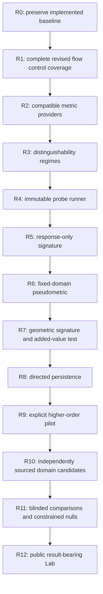

# Structural Geometry: operative revised roadmap

Date: 2026-09-06. Status: adopted development plan; new comparison APIs are planned.

This is the current implementation order. It incorporates the
[revised source proposal](proposals/ONTO2D_STRUCTURAL_GEOMETRY_SITE_IMPLEMENTATION.md)
with the corrections in the [analysis](REVISION_ANALYSIS.md) and
[design](DISTINGUISHABILITY_DESIGN.md). It replaces the original remaining stages
6–10 as an execution schedule. It does not replace implemented v1 contracts,
reset completed work, or change the kernel/Model Pack format.

## Current position and next work

Legacy stages 0–5 are implemented and tested. R0 captures their current baseline.
R1 is complete: its runner, normalization, stopping, certificates and published
recurrence are supplemented by [nine star/single-bridge flow controls](../../cases/structural-geometry/flow-controls/README.md).
All 33 supplemental states / 506 edge calculations agree with analytic and
NetworkX references. The original 11-run flow suite is preserved byte for byte.

R2 [MetricProvider](METRIC_PROVIDERS.md) is implemented with five capability
families, source-bound contexts and additive legacy envelopes. Its 13 provider
profiles and 73 legacy analyses replay exactly; see the [review](METRIC_PROVIDER_REVIEW.md).
SG2-010 [regime/observable contracts](REGIME_CONTRACTS.md) are complete: three
content-bound profiles, nine specs, explicit matching/scope policies and six
unevaluated source-bound preparations. SG2-011 [exact canonical observations](CANONICAL_OBSERVATIONS.md)
are now implemented: 17 measured artifacts, independent agreement on all 4,165
small directed graphs and 720 six-node relabelings. SG2-012
[directed topology observations](TOPOLOGY_OBSERVATIONS.md) are implemented with
23 artifacts and independent closure agreement on all 4,165 graphs; their
238 isomorphism classes give 69 summary classes, with collisions retained.
SG2-013 [typed observations and vocabulary alignment](TYPED_OBSERVATIONS.md) now
adds 26 observations, five mappings and eight alignment controls, with independent
739-graph / 145-class agreement and 720 relabelings. The next bounded task is
**SG2-014/015 strict comparison results and mandatory coverage**. Persistence
and website implementation remain later gates. The
[baseline record](BASELINE.md) defines preserved migration evidence.

Dependencies express acceptance order. Source reconnaissance and contract
design can proceed earlier, but neither supplies measured results or allows
outcome-driven mapping. A negative added-value result is retained and revises
claims; it is not grounds to tune the same benchmark until it becomes positive.

## Stage ledger

| Stage | Status now | Deliverables and acceptance gate |
|---|---|---|
| R0 — freeze baseline | Captured in this documentation revision | Pin exact sources, policies, outputs, implementation/test census and observed verification timing; check current files and retain prior full-suite evidence |
| R1 — deterministic flow | Complete for the revised bounded control gate | Nine supplemental runs: directed stars preserve unequal normalized lengths; a single bridge between two K4 groups separates at the fixed cap/cut; exact analytic and NetworkX agreement; 11 original trajectories unchanged |
| R2 — providers | Complete for the compatible built-in profile | Five providers, verified full-source contexts, six closed schemas, readonly/browser/engine contracts; 13 profiles and 73 legacy analyses replay exactly |
| R3 — distinguishability | In progress: SG2-010/011/012/013 complete | Three frozen contracts and source/scope preparation; all three observation evaluators and explicit vocabulary alignment verified independently; final tri-state/coverage results and the combined split/merge gate remain open |
| R4 — probes | Planned | Finite invariance/response registries, deterministic targets and immutable sandbox; byte-identical replay and complete transformation provenance |
| R5 — response v0 | Planned | Graph-native observations, compatible History/Identity/Motif hooks, coverage; invariant positives and justified negative controls; geometry excluded |
| R6 — pseudometric v0 | Planned | Fixed components/scales/weights and complete domain, separate comparison artifact, mathematical/property/reference checks; missingness never becomes zero |
| R7 — geometric signature v1 | Planned | Curvature/flow features with invariant descriptors and explicit coverage; compare response-only A against A+geometry B on frozen controls and held-out protocol; record benefit, redundancy or failure |
| R8 — directed topology v2 | Deferred behind R5–R7 | Select path or directed-flag construction and filtration; independently verify small complexes and test information beyond directed graph/motif/geometry baselines |
| R9 — higher-order v3 | Deferred | One independently reviewed joint-dependence case, pairwise/hypergraph comparison and simplicial representation only with justified downward closure; known inference test |
| R10 — domain candidates | Deferred | Four independently sourced native fragments, locked vocabulary/role and probe mappings, evidence/coverage; candidate status, no assumed positive labels |
| R11 — blinded benchmark | Deferred | Unit-disjoint evaluation, hard negatives, constrained nulls, strong graph and response baselines, sensitivity/coverage/cost; public success claims require robust evidence |
| R12 — Lab/homepage | Gated, not started | Result-bearing page consumes verified artifacts and presents actual findings/limits; see the separate website gate below |

## Task ledger and dependencies

“Complete” below refers to the current bounded computational contract, not
scientific validation. Planning a schema does not mark its implementation done.

| Task | Status | Scope, dependency and completion evidence |
|---|---|---|
| SG2-001 | Complete for current baseline | R0 inventory/source hashes and verification record in BASELINE; future revisions append a new baseline rather than overwrite this one |
| SG2-002 | Complete | Existing `/flow` runner, separate lengths and simultaneous updates |
| SG2-003 | Complete within current exact profile | Five stopping reasons plus explicit validation/process/numeric/resource errors; no partial success artifact |
| SG2-004 | Complete | Published recurrence plus separate frozen nine-run star/bridge suite; analytic optimality witnesses and independent full NetworkX replay; see FLOW_CONTROLS_REVIEW |
| SG2-005 | Complete | `/providers`, five capability families, source/dictionary-bound contexts, additive envelopes and exact legacy replay; see METRIC_PROVIDER_REVIEW |
| SG2-010 | Complete | `/regimes`, four closed schemas, three content-bound profiles, nine observable specs, bounded source/scope preparation and portable replay; see REGIME_CONTRACT_REVIEW |
| SG2-011 | Complete | `/canonical`, faithful bounded directed candidate translation, measured values and source mappings, two closed schemas; 4,165 graphs / 238 independent classes, 720 relabelings and 17 artifacts; see CANONICAL_OBSERVATION_REVIEW |
| SG2-012 | Complete | `/topology`, seven unchanged observable specs, two closed schemas, 23 artifacts, independent matrix closure on 4,165 graphs and disclosed canonical-class collisions; see TOPOLOGY_OBSERVATION_REVIEW |
| SG2-013 | Complete | `/typed`, joint five-field observations, explicit scoped gaps, full local dictionary/source binding, separately approved mappings and alignment; 739 colored graphs / 145 classes, 720 relabelings, 26 observations / 5 mappings / 8 alignments; see TYPED_OBSERVATION_REVIEW |
| SG2-014 | Next; observation evaluators complete | Three result statuses and exact distance/status consistency; no implicit threshold equivalence |
| SG2-015 | Next with SG2-014 | Strict mandatory coverage and typed missing/unavailable/rejected/invalid distinctions |
| SG2-020 | Planned; after R3 | Immutable probe sandbox, scoped derived graph, stable target mapping and work limits |
| SG2-021 | Planned; after SG2-020 | Serialization, relabel and presentation invariance controls; conditional abstractions remain separately scoped |
| SG2-022 | Planned; after SG2-020 | Feedback/constraint/direction/support probes with measured graph-native responses |
| SG2-023 | Planned; before compatible history profile ships | Existing History evidence/identity adapter and ablation hook; unavailable history remains indeterminate; not required as fake complete data for the first three regimes |
| SG2-024 | Planned; after SG2-021/022 | `ResponseSignature-v0`, frozen graph-native observables, aggregation, replay and coverage |
| SG2-030 | Planned; after SG2-024 | Complete-domain `StructuralPseudometric-v0`, fixed weights/scales and exact numeric policy |
| SG2-031 | Planned; with SG2-030 | Nonnegativity/symmetry/self-zero/triangle and invariant pullback checks, including a failing partial-data counterexample |
| SG2-032 | Planned; with SG2-030 | Null complete distance and exploratory partial coverage diagnostics |
| SG2-033 | Planned; with SG2-030 | Separate comparison schema; expected-source/policy replay and tamper/mismatch tests |
| SG2-040 | Planned; after R6 | `GeometricSignature-v1` consuming existing outputs, including interval/termination/trajectory-alignment policies |
| SG2-041 | Planned; after SG2-040 | Preregistered response-only versus response+geometry comparison; same units and coverage |
| SG2-042 | Planned; within R7 | Sensitivity across provider/context choices without promoting a metric on the test set |
| SG2-043 | Planned; within R7 | Step/idleness/cap/tolerance/cut robustness with failure rates and cost; no “converged” substitution for capped runs |
| SG2-050 | Deferred to R8 | Bounded persistent-path/directed-flag spike, independent complexes and added-information controls |
| SG2-051 | Deferred to R9 | Reviewed explicit higher-order case; no automatic parent-list simplex |
| SG2-052 | Deferred to R10 | Four real, independently sourced domain fragments, each with source lock and omissions |
| SG2-053 | Deferred to R10; freeze before scores | Abstract role/probe mapping, adjudication rules and versioned evidence |
| SG2-054 | Deferred to R11 design; freeze before evaluation | Hard negatives and constrained null generator, invariants, seed/budget and leakage checks |
| SG2-055 | Deferred to R11 | Blinded comparison against all preregistered baselines with negative/indeterminate outcomes retained |
| SGWEB2-001 | Gated | Homepage foundation strip and research map |
| SGWEB2-002 | Gated | Structural Geometry Lab shell, verified artifact selection and source panel |
| SGWEB2-003 | Gated | Regime selector with compatibility and missingness states |
| SGWEB2-004 | Gated | Graph → Geometry → Flow → Signature interaction over one selected source/pair |
| SGWEB2-005 | Gated behind R10/R11 for results | Four-domain candidate view; illustrative diagrams cannot carry measured scores |
| SGWEB2-006 | Gated | Methods, baselines, falsification, negative results, coverage and evidence panel |
| SGWEB2-007 | Gated; source identification pending | Vision/distinguishability analogy, properly sourced or clearly generic explanation |

## Completed supplement and next acceptance checklist

SG2-004 is recorded in the [control review](FLOW_CONTROLS_REVIEW.md). Its
[protocol](../../cases/structural-geometry/flow-controls/PROTOCOL.md) fixed graphs,
step, idleness, normalization, iteration/cut policy and expected behavior before
runtime generation. Both star directions are fixed at iteration 1 across all
four step/idleness combinations. The two-K4 bridge exceeds the fixed threshold
at state 16 while every internal edge remains below it; the run stops at its
cap, without a convergence claim. The old suite and all 117 pinned legacy
scientific input/schema/golden files are unchanged. Future controls must retain
failed expectations and use separate versions instead of tuning accepted inputs.

SG2-005 follows the [provider contract](METRIC_PROVIDERS.md), fixed before the
shared-function extraction. Its [review](METRIC_PROVIDER_REVIEW.md) records
exact legacy values/context, six additive closed schemas, immutable capabilities,
explicit rejection of discrete views as lengths, missing/invalid weight behavior,
source replay, tamper checks and browser/engine compatibility. Ordinary
root/experiment/Ollivier/flow entrypoints retain their existing contracts.

SG2-010 implements the [frozen contract](REGIME_CONTRACTS.md) and
[reviewed preparation boundary](REGIME_CONTRACT_REVIEW.md). All six examples
carry `evaluation: "not-run"`; no evaluator, comparison or passing probe result
is implied by those preparations. SG2-011 separately implements the exact
untyped observation under the declared six-node/30-edge/100,000-search-state
policy; its [review](CANONICAL_OBSERVATION_REVIEW.md) records independent
enumeration, mapping witnesses, browser replay and preserved preparation bytes.
SG2-012 implements the frozen seven-observable directed topology profile; its
[review](TOPOLOGY_OBSERVATION_REVIEW.md) records independent matrix closure,
retained isolates, explicit maximum work and the outward/inward-star collision
separated by exact canonical analysis. Prior identities and case bytes remain.

SG2-013 implements the frozen joint typed observation and explicit vocabulary
alignment; its [review](TYPED_OBSERVATION_REVIEW.md) records independent class and
witness checks, source-bound mappings, external approval, scoped field gaps and
recanonicalization after code translation. Local code equality is not semantic
authority; unresolved mapping/type evidence leaves aligned values null.

SG2-014/015 next add the final comparison contract across all three regimes.
Implement the three declared statuses and strict mandatory coverage, retaining
observed differences as diagnostics when any mandatory component is incomplete.
Bind exact expected sources/scopes/regimes, typed vocabulary mapping and approval.
Test complete equality/difference, null-distance consistency, incomplete/invalid
evidence, empty profiles and the combined split/merge controls. Preserve every
existing observation identity. The [R3 constraints](DISTINGUISHABILITY_DESIGN.md)
remain authoritative; do not close R3 or advance the website gate until executable
status and coverage semantics pass these controls.

Public pages, new history semantics and response-derived lengths remain separate
ledger items with distinct acceptance evidence.

## Website readiness and claim gates

The [website plan](WEBSITE_PLAN.md) distinguishes a methods explanation from
public comparative scientific claims. Current readiness:

- [x] Existing projection/metric/curvature/flow outputs and exact sources are pinned.
- [x] Bounded flow is deterministic and has explicit stop/failure semantics.
- [x] Expanded R1 star/single-bridge flow controls are verified.
- [x] Existing metrics/views are accessible through explicit compatible providers.
- [ ] At least three distinguishability regimes and strict indeterminate semantics work.
- [ ] Frozen invariance/response probes replay without source mutation.
- [ ] Response v0 and complete-domain pseudometric v0 pass their controls.
- [ ] Geometric signature v1 and at least one response-only versus geometry result exist.
- [ ] Composite/comparison artifacts bind all implemented source/policy layers.
- [ ] R10/R11 data, mappings, baselines and evaluation support any cross-domain result shown.
- [x] The planned site does not require a positive cross-domain equivalence claim to function.

R12 is the full result-bearing target after the preceding research stages have
been evaluated. A narrower method-under-test page may be scheduled after R0–R7
readiness, but must expose actual methods/results and cannot imply that R8–R11
exist. A negative geometry result can be published transparently; it does not
authorize a positive similarity claim. Website implementation remains gated.

## Research stop and revision rules

Use the [H0–H8 benchmark protocol](BENCHMARK_PROTOCOL.md). Computational agreement
closes arithmetic gates, not empirical usefulness. If geometry is redundant
with response-only or graph baselines, retain it as a descriptive/decomposition
tool and revise the next hypothesis openly. If a regime/probe/profile has
insufficient data, preserve indeterminate coverage rather than drop hard cases.
Do not claim a universal structural metric, common cause or physical identity.

Record every implementation milestone with source/policy locks, commands,
frozen controls, actual local/CI evidence and unresolved limitations. Independent
scientific review remains distinct from independent algorithm agreement.
