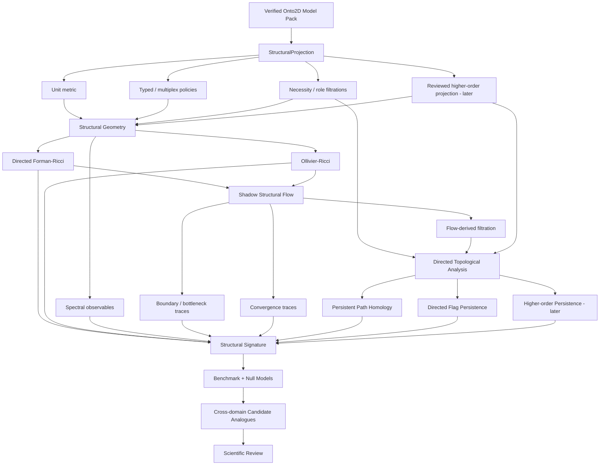

# Onto2D Structural Geometry Roadmap

## From Typed Emergence Graphs to Curvature, Flow, Persistent Structure, and Cross-Domain Signatures

**Status:** Research and architecture proposal  
**Project:** Onto2D / SOMA  
**Date:** 2026-09-05  
**Scope:** Add a new analytical layer without changing the locally closed schema-v1 kernel  
**Primary inspiration:** Hamilton–Perelman strategy: geometry + evolution + invariants as a route to global structural information  
**Important:** This document does **not** claim that Perelman's proof, the Poincaré conjecture, or smooth Ricci flow directly applies to Onto2D.

---

## 1. Executive decision

Onto2D should not be redesigned around topology or Ricci flow. The correct transition is to keep the current canonical model intact and add a **read-only structural-geometry research stack** above verified Model Packs.

The transition should be:

```text
Canonical Onto2D Model Pack
        |
        | immutable source semantics
        v
Typed Structural Projection
        |
        | explicit, versioned representation policy
        v
Intrinsic / Shadow Geometry
        |
        +--> directed Forman-Ricci curvature
        +--> Ollivier-Ricci curvature
        +--> spectral / path-based observables
        |
        v
Structural Flow
        |
        | evolves shadow metric only
        v
Stable structural events
        |
        +--> bottlenecks
        +--> dense cores
        +--> candidate boundaries
        +--> flow convergence behavior
        |
        v
Topological / multiscale analysis
        |
        +--> persistent path homology
        +--> directed flag-complex persistence
        +--> explicit higher-order complexes where justified
        |
        v
Structural Signature
        |
        v
Cross-domain comparison and falsifiable benchmarks
```

The immediate goal is **not** to prove that two phenomena are “the same emergence.” The immediate goal is to determine whether Onto2D's typed causal structure admits useful, reproducible, representation-aware geometric and topological observables.

The long-term research question is:

> **Can typed emergence mechanisms from different scientific domains exhibit stable structural signatures that remain recognizable despite differences in terminology, local graph realization, and scientific scale?**

This is a legitimate, falsifiable extension of Onto2D. It is also much stronger than adding another graph visualization metric.

---

## 2. Why the Perelman connection is useful — and where it stops

The useful lesson from Hamilton and Perelman is not “apply the Poincaré theorem to a knowledge graph.” The useful lesson is an **algorithmic strategy**.

A difficult global classification problem can sometimes be attacked indirectly:

1. start with a complicated representation;
2. attach a geometry to it;
3. evolve that geometry under a controlled flow;
4. identify quantities that constrain the evolution;
5. treat singular or extreme regions as structural information rather than random failure;
6. obtain a simpler decomposition or normal form from which global structure is easier to classify.

In the smooth 3-manifold setting, Hamilton introduced Ricci flow, and Perelman supplied critical monotonicity/non-collapsing and singularity-control machinery that completed the geometrization program. The Clay Mathematics Institute describes the proof specifically as the use of geometric arguments, especially Hamilton's Ricci flow, to establish the Poincaré conjecture, with Ricci flow with surgery playing a central role.

For Onto2D, the transferable pattern is:

| Hamilton–Perelman setting | Onto2D research analogue | Status of analogy |
|---|---|---|
| 3-manifold | typed directed emergence structure | conceptual only |
| Riemannian metric | explicit structural metric policy | actionable |
| Ricci curvature | discrete network curvature | mathematically established analogue, but not equivalent |
| Ricci flow | evolution of shadow edge lengths/weights | actionable research method |
| singular/high-curvature region | bottleneck / structural boundary / critical local configuration | heuristic until benchmarked |
| surgery | analytical partition of the shadow graph | existing network-Ricci precedent, but not Perelman surgery |
| geometric decomposition | structural decomposition | actionable |
| invariant / monotone quantity | stable signature / convergence observable | research target |
| topological classification | mechanism-family comparison | **not** a theorem unless separately proven |

The discipline here is important. We may borrow the **strategy**, but we must not borrow conclusions.

---

## 3. Why the Bailey 2026 paper matters

The paper you found is:

**Mark M. Bailey, “Topology as a Language for Emergent Organization in Complex Systems: Multiscale Structure, Higher-Order Interactions, and Early Warning Signals,” arXiv:2603.25760v1, 25 March 2026.**

It is a **review/preprint**, not a new Perelman-like algorithm. However, conceptually it is unusually close to the direction Onto2D is already moving toward.

### 3.1 The representation problem

Bailey starts from the claim that the scientific problem in complex systems is often representational: local components and pairwise relations do not necessarily expose the organization that matters at system level.

That maps directly onto Onto2D's central concern. Onto2D already treats the relation structure of an arising as first-class data rather than reducing it to a flat label or scalar score.

The important consequence for this roadmap is:

> The structural projection used for geometry is not a harmless preprocessing step. It is a scientific hypothesis and must therefore be explicit, versioned, testable, and reproducible.

### 3.2 Higher-order relations are not automatically reducible to edges

Bailey emphasizes a crucial distinction: a group interaction can be causally different from several independent pairwise interactions. Hypergraphs and simplicial complexes are not interchangeable either; a simplicial complex imposes downward closure, while a hypergraph does not.

This matters enormously for Onto2D.

Current `Parents[]` entries give us multiple typed parent relations into an arising. They do **not**, by themselves, prove that a set of parents forms one irreducible joint causal event.

Therefore this is invalid:

```text
A -> X
B -> X
C -> X

therefore

{A, B, C} -> X is one irreducible hyperedge
```

That inference may be scientifically correct in a particular case, but it is not encoded by the current pairwise parent records alone.

The roadmap must therefore distinguish:

```text
observed / reviewed higher-order relation
```

from

```text
higher-order structure induced by an analysis policy
```

and never silently convert one into the other.

### 3.3 Geometry and topology have different jobs

Bailey's review explicitly separates geometry from topology:

- geometry asks about distances, neighborhoods, curvature, smoothness, embeddings, and geodesics;
- topology asks which qualitative structural relations remain after exact metric detail is relaxed;
- persistent topology uses geometry or another scalar function to build a filtration and then measures which structures survive across scale.

This suggests a clean Onto2D architecture:

```text
Onto2D semantics
    |
    v
Structural geometry
    |
    v
Filtration / multiscale family
    |
    v
Topological observables
```

Do not merge those three layers.

### 3.4 The review explicitly asks for topological-dynamical hybrids

The paper's research agenda argues that topology should move beyond static description and become coupled to dynamics, higher-order operators, control, and models of reachable transitions.

That is almost exactly where the Perelman-inspired idea becomes interesting for Onto2D:

```text
static typed graph
    -> geometry
    -> controlled evolution
    -> structural observables
```

### 3.5 The review also gives us the warnings we need

The most useful parts of the paper are not only the positive claims. It explicitly warns that:

- representation dependence is irreducible;
- a persistent feature is not automatically scientifically significant;
- null models matter;
- topology does not establish causal mechanism by itself;
- interpretability remains difficult;
- one-parameter filtrations may be too narrow for complex systems.

Those points should become design constraints for Onto2D, not footnotes.

---

## 4. The current Onto2D substrate is already suitable for Phase 1

The current Onto2D arising schema contains much more than ordinary graph connectivity.

At node level it includes, among other fields:

- `Level`
- `Phase`
- `TypeRole`
- `Science[]`
- `ScientificStatus`
- `Requirements.MustCover[]`
- `Requirements.ShouldCover[]`
- `Requirements.OptionalCover[]`

Each parent relation currently includes:

- `ParentCode`
- `CausalDirections[]`
- `InteractionModes[]`
- `Weight`
- `Necessity`
- `DependencyType`
- `OntologicalRole`
- optional `Quantization`

This means Onto2D is not merely:

```text
V + E
```

It is closer to:

```text
V
+
E(direction, causal-direction, interaction-mode, dependency-type,
  necessity, local-weight, lifecycle-role, quantization, evidence context)
```

That is enough to begin a serious **typed directed structural geometry** experiment without changing the source model.

There is also an architectural reason not to change the kernel: the current repository deliberately keeps the schema-v1 kernel locally closed, while the engine supports **explicitly registered analyses** over verified Model Packs. The scientific-adapter package already establishes a boundary for external numerical implementations. This roadmap should use those boundaries rather than creating alternative kernel semantics.

---

## 5. Non-negotiable architectural boundary

### 5.1 The canonical model is immutable input

Never do this:

```js
edge.Weight = ricciFlow(edge.Weight);
```

Never rewrite:

- `Parents`
- causal directions
- dependency types
- scientific status
- evidence
- canonical IDs
- Model Pack identity

because a structural-analysis result is not new source knowledge.

### 5.2 All geometry is a shadow representation

Use an explicit derived object:

```ts
interface StructuralEdgeState {
  sourceEdgeId: string;
  source: string;
  target: string;

  metricLength: number;
  curvature?: number;
  flowLength?: number;

  projectionLayer: string;
}
```

The relation back to the canonical model must always be inspectable.

### 5.3 Every analytical result must bind to exact model identity

At minimum:

```ts
interface StructuralAnalysisIdentity {
  modelId: string;
  modelVersion: string;
  modelRootHash: string;
  manifestHash: string;

  projectionPolicyId: string;
  projectionPolicyHash: string;

  metricPolicyId: string;
  metricPolicyHash: string;

  algorithmId: string;
  algorithmVersion: string;
  parametersHash: string;
}
```

A result without those bindings is exploratory visualization, not a reproducible Onto2D scientific artifact.

---

## 6. First new concept: `StructuralProjection`

Do **not** begin with Ricci curvature. Begin by making the representation boundary explicit.

```ts
interface StructuralProjectionPolicy {
  id: string;
  version: string;

  directionMode: "native" | "symmetrized";
  includedOntologicalRoles: string[];
  includedNecessities: string[];
  includedDependencyTypes?: number[];
  includeQuantization: boolean;

  higherOrderPolicy: "none" | "reviewed-only" | "explicit-induced";
}
```

The output is a deterministic analysis graph:

```ts
interface StructuralProjection {
  nodes: StructuralNode[];
  edges: StructuralEdge[];
  provenance: ProjectionProvenance;
}
```

### 6.1 Phase-1 default projection

The first projection should be deliberately conservative:

```text
native directed graph
+ all reviewed source-parent relations
+ no inferred hyperedges
+ no UI/layout coordinates
+ no learned embedding
+ no semantic scalarization of relation categories
```

Call it, for example:

```text
causal-directed-v1
```

### 6.2 Why layout coordinates are forbidden

Onto2D's 2D layout is a presentation function. It is not intrinsic scientific geometry.

Therefore this is forbidden:

```js
metricLength = distance(nodeA.screenPosition, nodeB.screenPosition);
```

Otherwise the analysis discovers properties of the renderer rather than properties of the ontology.

---

## 7. Second new concept: `StructuralMetricPolicy`

A graph does not arrive with one scientifically privileged metric. Bailey's review is explicit that metric/filtration choice is part of the representation problem.

Therefore Onto2D should support multiple metric hypotheses from day one.

### 7.1 Metric A — structural unit metric

The safest baseline:

```text
length(e) = 1
```

This asks:

> What geometry is implied by connectivity alone?

It is boring, and that is why it is essential as a baseline.

### 7.2 Metric B — contribution-derived metric

A candidate research metric could derive distance from `Weight` with a monotone transform.

For example:

```text
larger contribution -> shorter structural distance
```

Candidate transforms could include:

```text
l(e) = 1 / (epsilon + Weight)
```

or

```text
l(e) = -log(epsilon + Weight)
```

but **neither should be declared semantically correct without benchmarking**.

There is an important Onto2D-specific complication: the schema describes `Weight` as a relative parent contribution expected to be normalized across the parents of a child. That makes it primarily a **local comparative quantity**, not automatically a globally calibrated distance scale.

Therefore the initial implementation must not treat raw `Weight` as a globally commensurate metric without an explicit policy.

### 7.3 Metric C — necessity filtration instead of arbitrary numeric mapping

`Necessity` gives Onto2D a potentially cleaner multiscale construction than forcing categories into arbitrary distances.

Create nested relation sets:

```text
G0 = necessary only
G1 = necessary + enabling
G2 = necessary + enabling + contextual
G3 = all relations including optional
```

This is an Onto2D-native filtration candidate.

It asks:

> Which structures exist already under the strongest dependency regime, and which only appear when weaker relations are admitted?

This may be more scientifically interpretable than assigning numbers such as:

```text
necessary = 1.0
enabling = 0.75
contextual = 0.5
optional = 0.25
```

and pretending those numbers have metric meaning.

### 7.4 Metric D — typed multiplex geometry

`DependencyType`, `InteractionModes`, and `CausalDirections` should initially remain separate channels rather than be collapsed into a single number.

Conceptually:

```text
          substrate layer
         /               \
Node A -----------------> Node B
         \               /
          regulation layer
```

Then analysis can ask:

```text
curvature on substrate relations
curvature on regulatory relations
curvature on constraint relations
curvature on the union
```

instead of inventing:

```text
substrate = 0.73
regulation = 0.41
constraint = 0.88
```

### 7.5 Epistemic geometry must stay separate from causal geometry

`ScientificStatus`, evidence quality, provenance, or future epistemic coding can define another analytical axis, but they must not silently modify causal-mechanistic distance.

Use separate policies:

```text
mechanism geometry
!=
epistemic geometry
```

A low-confidence causal edge is not necessarily a weak causal relation. It is a less certain claim about the relation.

---

## 8. Phase 1 curvature: start with directed Forman-Ricci

### 8.1 Why Forman first

Forman-Ricci curvature has several practical advantages for the first Onto2D experiment:

- discrete versions exist for weighted directed networks;
- computation is local and comparatively cheap;
- extensions exist for higher-order structures and directed hypergraphs;
- it gives immediate per-edge and per-node observables;
- it is simple enough to implement deterministically in JavaScript and verify against an external oracle.

The 2019 work on discrete Ricci curvatures for directed networks explicitly develops directed Forman, directed Ollivier, and augmented Forman variants that account for higher-order faces.

### 8.2 What curvature means here

Do **not** write documentation saying:

> negative curvature means this causal relation is bad

or:

> positive curvature means stronger emergence

Curvature is a structural geometric observable under a chosen graph metric.

The initial semantics should be deliberately minimal:

```text
curvature(edge)
=
a descriptor of how the local neighborhoods around the edge are arranged
under a declared metric and curvature definition
```

Interpretation comes only after benchmarking.

### 8.3 First test graphs

Before running against Onto2D, use mathematical/synthetic fixtures:

```text
path
cycle
star
tree
clique
two dense clusters joined by one bridge
DAG
layered DAG
feed-forward motif
feedback motif
```

For every fixture store exact expected outputs as goldens.

### 8.4 Initial Onto2D outputs

For an exact Model Pack and projection:

```json
{
  "edgeCurvature": {},
  "nodeCurvature": {},
  "distribution": {},
  "byLevel": {},
  "byDependencyType": {},
  "byNecessity": {},
  "extremeEdges": [],
  "diagnostics": {}
}
```

The first useful product is not a pretty graph. It is a reproducible artifact answering:

```text
Where does Onto2D's typed causal graph exhibit structurally unusual local geometry?
```

---

## 9. Direct precedent: GeOKG makes this direction much less speculative

A particularly relevant peer-reviewed precedent is:

**Jeong et al., “GeOKG: geometry-aware knowledge graph embedding for Gene Ontology and genes,” Bioinformatics 41(4), 2025, btaf160. DOI: 10.1093/bioinformatics/btaf160.**

The authors explicitly compute and visualize **Forman-Ricci curvature of the Gene Ontology graph** and report heterogeneous curvature behavior. They use this as motivation for a mixed-geometry embedding architecture rather than forcing the whole ontology into one geometric space.

This is highly relevant because Gene Ontology is not merely an arbitrary social network; it is an ontology / hierarchical knowledge structure.

However, GeOKG and the proposed Onto2D work have different goals:

| GeOKG | Onto2D structural geometry |
|---|---|
| optimize embeddings | characterize mechanism structure |
| learned representation | deterministic analysis first |
| downstream PPI prediction | cross-domain structural comparison |
| multiple latent geometric spaces | explicit metric/projection policies |
| curvature helps motivate embedding choice | curvature is itself a measured structural observable |

We should cite GeOKG as a strong practical precedent, but not copy its architecture as the first Onto2D implementation.

A 2026 medRxiv preprint also applies exact Ollivier-Ricci curvature to biomedical ontologies and other biomedical networks, including Human Phenotype Ontology. It is useful supporting evidence that ontology curvature is becoming an active research direction, but it remains a preprint and should be labeled accordingly.

---

## 10. Phase 2: add Ollivier-Ricci curvature

Forman curvature is a good local baseline. Ollivier-Ricci curvature is the more natural next step when we care about neighborhood transport and flow.

Conceptually, for an edge `u -> v`:

```text
look at a probability distribution around u
look at a probability distribution around v
ask how expensive it is to transport one local neighborhood into the other
compare that transport distance to the direct u-v distance
```

This is computationally much more expensive, but it captures something closer to neighborhood convergence/divergence.

### 10.1 Why it is important for Onto2D

Suppose two local structures have similar degree statistics:

```text
A -- X -- B
```

but in one case the neighborhoods on each side overlap heavily, while in the other case `X` is the only narrow bridge between two otherwise separate regions.

Transport-based curvature can distinguish those geometries more naturally than simple degree counts.

### 10.2 Initial implementation policy

Do not immediately write an optimized JavaScript Ollivier solver.

Use the existing scientific-adapter boundary:

```text
Onto2D JS projection
    |
    v
exact normalized analysis request
    |
    v
external research oracle
    |
    v
validated response artifact
```

An external Python reference implementation can initially serve as a scientific oracle for verification. Only after the method proves useful should a production-grade implementation be brought closer to the JS runtime.

---

## 11. Phase 3: structural Ricci flow

This is the step most directly inspired by the conversation about Perelman.

### 11.1 The source graph still does not change

Flow operates on:

```text
shadow metric length
```

not on:

```text
Onto2D semantic Weight
```

The source model remains immutable.

### 11.2 Network Ricci flow already exists as a method

Ni, Lin, Luo, and Gao (Scientific Reports, 2019) developed a network community-detection method using discrete Ollivier-Ricci flow. Under their flow, negatively curved inter-community edges tend to expand while positively curved intra-community edges tend to shrink. Thresholding long edges after flow acts as a network analogue of “surgery” for community decomposition.

This is extremely relevant because it shows that the analogy:

```text
curvature -> flow -> structural separation
```

is not merely philosophical; it already exists in network science.

But Onto2D must not assume that “community” is the object we want. We want to discover whether flow exposes **mechanism boundaries, structural bottlenecks, or stable substructures** in a typed causal ontology.

### 11.3 Proposed flow state

```ts
interface FlowEdgeState {
  edgeId: string;
  iteration: number;
  length: number;
  curvature: number;
}
```

Store at each iteration:

```text
curvature distribution
edge-length distribution
maximum update magnitude
total normalized length
candidate extreme edges
component / partition state if analytical cuts are enabled
```

### 11.4 Normalization is mandatory

Without normalization, a flow can collapse or expand in trivial ways depending on the definition.

A first research implementation must specify:

```text
normalization strategy
step size
convergence criterion
iteration cap
cut policy
```

as part of the algorithm identity.

No hidden defaults.

### 11.5 “Surgery” must be renamed internally at first

For scientific discipline, the first Onto2D implementation should call it something like:

```text
flow-boundary cut
```

rather than `surgery`.

Reason: network papers use the surgery analogy, but calling our operation “Perelman surgery” would overstate the mathematics.

The result is an **analytical partition**, not a change to ontology truth.

---

## 12. What we actually want from flow

Community detection is not the final objective. The useful questions are:

### 12.1 Bottleneck discovery

Find relations for which local neighborhoods are structurally separated:

```text
large upstream causal family
          |
          | narrow bridge
          v
large downstream family
```

### 12.2 Structural boundary discovery

Does the graph naturally decompose into regions whose internal causal organization is much denser/more coherent than the relations between them?

### 12.3 Bridge-type classification

Are different bridge edges dominated by different semantic relation types?

For example:

```text
substrate bridge
constraint bridge
information bridge
regulatory bridge
```

This is where Onto2D's typed relations make the problem richer than ordinary community detection.

### 12.4 Flow trajectory as a signature

Do not only retain the final partition.

The trajectory itself may be informative:

```text
iteration -> curvature distribution
iteration -> edge-length entropy
iteration -> boundary set
iteration -> partition stability
```

Two graph fragments could have different raw adjacency yet exhibit similar flow dynamics.

That is a much more interesting candidate for a cross-domain structural signature.

---

## 13. Phase 4: higher-order structure — only after explicit semantics exist

This phase should **not** be implemented by automatically converting every set of parents into a hyperedge.

### 13.1 Why ordinary `Parents[]` are insufficient

Consider:

```text
A -> X
B -> X
C -> X
```

Possible interpretations include:

```text
A, B, C independently contribute to X
```

or:

```text
A AND B AND C jointly create a condition required for X
```

or:

```text
any two are sufficient
```

or:

```text
A is substrate, B is boundary, C is regulation
```

Those are different higher-order mechanisms.

### 13.2 Proposed experimental higher-order layer

Do not add it to schema-v1 first. Add a separate reviewed analysis/model extension:

```ts
interface HigherOrderRelation {
  id: string;

  sources: string[];
  target: string;

  semantics:
    | "jointly-necessary"
    | "joint-event"
    | "collective-constraint"
    | "cooperative-realization";

  representation: "hyperedge" | "simplex";
  closurePolicy: "none" | "downward";

  evidenceRefs: string[];
}
```

Only a reviewed record can assert irreducible higher-order semantics.

### 13.3 Hypergraph vs simplicial complex must remain explicit

Use a **hypergraph** when the group relation exists but lower-order subgroups are not automatically the same relation.

Use a **simplicial complex** only when downward closure is scientifically justified.

This distinction comes directly from the modern higher-order network literature and is emphasized in the Bailey review.

### 13.4 Why this can become very powerful for Onto2D

Onto2D is about arisings. Many real emergence mechanisms are likely to depend on joint configurations rather than independent edges.

A future representation such as:

```text
{substrate, boundary, gradient, regulation} => arising
```

could be more faithful than four unrelated edges.

Once those relations are explicit, Forman-type curvature has extensions to directed hypergraphs, giving us a mathematically grounded route beyond pairwise graph geometry.

---

## 14. Phase 5: topology of the directed Onto2D graph

Ordinary persistent homology is not automatically the best first topological method for Onto2D because Onto2D is directed and typed.

Two especially relevant options should be evaluated.

### 14.1 Persistent path homology

Persistent path homology was developed specifically for directed networks and is sensitive to asymmetry that ordinary undirected persistent homology can erase.

This is conceptually well matched to Onto2D because:

```text
A -> B
```

is not semantically equivalent to:

```text
B -> A
```

and causal direction is central to the model.

A first persistent-path experiment can operate on a filtered directed projection without inventing a simplicial complex.

### 14.2 Directed flag complexes

Another option is to construct a directed flag complex and compute persistent homology over it. Efficient tools such as `flagser` exist for this class of problem.

However, a directed flag complex still represents a particular **lifting policy** from graph relations to higher-dimensional cells.

Therefore its output must be labeled as:

```text
topology of projection X under complex-construction policy Y
```

not:

```text
the topology of Onto2D
```

### 14.3 Native Onto2D filtration candidates

Useful filtration axes include:

1. necessity regime;
2. relation `Weight` threshold under a declared local/global normalization policy;
3. selected dependency-type layers;
4. selected ontological-role layers (`arising`, `maintenance`, `modulation`);
5. epistemic status — **as a separate epistemic filtration**;
6. quantization threshold data where scientifically meaningful;
7. flow-derived shadow length;
8. flow-derived curvature.

### 14.4 The one-parameter problem

Onto2D is intrinsically multi-axis:

```text
relation strength
necessity
causal direction
dependency type
interaction mode
epistemic status
level / phase
```

A single scalar filtration will inevitably destroy some structure.

Therefore the correct progression is:

```text
single-parameter baselines
    -> compare multiple single-parameter views
    -> only then investigate multiparameter persistence
```

Do not begin with multiparameter persistence. It is methodologically heavier and harder to summarize, exactly as the Bailey review notes.

---

## 15. Phase 6: define a `StructuralSignature`

This is the point where the project becomes more than graph analysis.

The signature should initially be a **vector of separately interpretable observables**, not one magic score.

```ts
interface StructuralSignature {
  identity: StructuralAnalysisIdentity;

  graph: {
    nodeCount: number;
    edgeCount: number;
    typedMotifs: object;
    degreeProfile: object;
  };

  curvature: {
    forman?: CurvatureSummary;
    ollivier?: CurvatureSummary;
  };

  flow?: {
    convergenceTrace: number[];
    boundaryPersistence: object;
    partitionTree?: object;
  };

  topology?: {
    pathHomology?: object;
    directedFlagPersistence?: object;
    higherOrderPersistence?: object;
  };

  spectral?: {
    graphLaplacian?: object;
    hodgeLaplacian?: object;
  };
}
```

### 15.1 Do not call it a complete invariant

A signature may fail to distinguish non-equivalent structures.

Therefore:

```text
same signature
```

does **not** imply:

```text
same mechanism
```

unless a theorem is eventually proved for a restricted class.

Use terminology carefully:

```text
structural signature
structural similarity evidence
candidate equivalence
```

not:

```text
proof of equivalence
```

### 15.2 Avoid an early “93% same mechanism” score

Initially return a comparison vector:

```json
{
  "formanDistance": 0.12,
  "ollivierDistance": 0.18,
  "flowTraceDistance": 0.09,
  "pathPersistenceDistance": 0.14,
  "typedMotifDistance": 0.21
}
```

Do not collapse it into:

```text
Similarity = 91.7%
```

until there is a validated statistical model showing that such a scalar has stable meaning.

---

## 16. Phase 7: cross-domain structural comparison

This is the long-term scientific payoff.

### 16.1 Fragment extraction

A comparison unit should not be the entire Onto2D graph.

Define a deterministic local mechanism fragment around an arising:

```ts
interface FragmentPolicy {
  root: string;
  upstreamDepth: number;
  downstreamDepth: number;
  includeMaintenance: boolean;
  includeModulation: boolean;
  dependencyTypes?: number[];
}
```

Possible fragment families:

```text
formation fragment
maintenance fragment
modulation fragment
full local causal neighborhood
```

### 16.2 Remove domain naming from the comparison channel

For a cross-domain structural test, create a normalized structural view in which labels such as:

```text
protein
institution
crystal
neuron
compiler
```

are hidden from the comparison algorithm.

Retain only declared structural semantics:

```text
TypeRole
DependencyType
Necessity
InteractionMode
CausalDirection
OntologicalRole
```

Then ask whether two fragments remain similar.

This is much closer to the scientific question:

> Are apparently different domain mechanisms structurally analogous?

### 16.3 Compare against strong baselines

Any claimed advantage must beat ordinary graph methods.

At minimum compare against:

- degree distributions;
- typed motif counts;
- graph edit distance on bounded fragments;
- Weisfeiler–Lehman style graph kernels / hashing;
- spectral signatures;
- community/betweenness metrics;
- embedding-based similarity where appropriate.

If curvature/flow/topology adds no discriminative value beyond these, the ambitious method is unnecessary.

---

## 17. The central scientific benchmark

The research program needs a benchmark before it needs a UI.

### 17.1 Gold classes

Build three pair classes:

```text
A. structurally equivalent / near-equivalent by construction
B. superficially similar but mechanistically different
C. clearly different controls
```

Do this first with synthetic structures where ground truth is known.

Then add expert-reviewed Onto2D cross-domain candidates.

### 17.2 Synthetic positive controls

Examples:

```text
same directed typed motif with node IDs permuted
same graph with edge order permuted
same graph serialized differently
same mechanism embedded into a larger irrelevant context but extracted by exact scope policy
```

These **must** produce equivalent outputs where the analysis claims representation invariance.

### 17.3 Synthetic negative controls

Examples:

```text
feed-forward vs feedback loop
independent parents vs explicit joint hyperedge
bridge vs dense closure
necessary relation replaced by optional relation
causal direction reversed
```

The signature should distinguish these if the relevant semantic channel is enabled.

### 17.4 Important non-invariance controls

Some transformations must *not* be assumed harmless.

For example, subdividing:

```text
A -> B
```

into:

```text
A -> X -> B
```

is not automatically semantics-preserving in an ontology. If `X` is a genuine arising, the mechanism has changed at the modeled level.

Therefore “graph refinement invariance” must never be assumed globally.

### 17.5 Null models

The Bailey review correctly emphasizes that stability is not significance.

For Onto2D, useful nulls may preserve:

```text
node count
in/out degree sequence
level distribution
dependency-type counts
necessity counts
ontological-role counts
```

while randomizing selected connectivity.

Then ask whether a measured curvature/topological signature is unusual relative to a constrained null, not merely relative to an Erdős–Rényi graph.

---

## 18. Falsifiable hypotheses

The program should be organized around hypotheses that can fail.

### H1 — Curvature contains nontrivial structural information

> Directed typed curvature profiles distinguish known mechanism motifs better than degree and centrality baselines.

**Fail condition:** performance is equal to or worse than simple baselines.

### H2 — Flow improves structural separation

> Curvature flow increases separation between known cross-structure classes while preserving similarity among representation-equivalent controls.

**Fail condition:** flow adds no information or creates unstable dependence on arbitrary parameters.

### H3 — Onto2D-native filtrations produce stable signatures

> Necessity- and typed-relation filtrations yield persistent features more stable and interpretable than arbitrary scalar edge thresholds.

**Fail condition:** persistence is dominated by representation policy and does not survive reasonable perturbations.

### H4 — Direction-sensitive topology matters

> Persistent path homology or directed-complex methods discriminate causal motifs that ordinary undirected persistent homology conflates.

**Fail condition:** directional methods provide no measurable advantage on directed controls.

### H5 — Explicit higher-order semantics add information

> Reviewed higher-order relations improve discrimination of mechanisms that pairwise projections cannot distinguish.

**Fail condition:** higher-order representations add complexity without benchmark improvement.

### H6 — Cross-domain structural analogues exist

> Expert-reviewed mechanism analogues from different domains are measurably closer in structural-signature space than matched constrained null pairs.

**Fail condition:** within-domain naming/level artifacts dominate and cross-domain analogues do not cluster beyond null expectation.

This last failure would be scientifically valuable. It would mean Onto2D's universal structural vocabulary is not yet sufficient for the claimed cross-domain comparison task.

---

## 19. Proposed package architecture

Do not create five packages immediately. Start with one isolated research package and split only after boundaries stabilize.

### 19.1 Initial package

```text
packages/
  structural-geometry/
    src/
      projection/
      metric/
      curvature/
      flow/
      signature/
      artifacts/
    test/
      fixtures/
      goldens/
```

Suggested package name:

```text
@onto2d/structural-geometry
```

### 19.2 External numerical boundary

Use:

```text
@onto2d/scientific-adapter
```

for expensive/reference implementations such as:

```text
Ollivier-Ricci optimal transport
persistent path homology reference computation
directed flag-complex persistence
multiparameter persistence experiments
```

until a stable implementation strategy is chosen.

### 19.3 Engine registration

The engine already supports explicitly registered analyses. The eventual API should look conceptually like:

```js
const result = await onto.analyze("structural-geometry", {
  scope: {
    kind: "mechanism-fragment",
    root: "5.12",
    upstreamDepth: 3,
    downstreamDepth: 1
  },
  projection: "causal-directed-v1",
  metric: "unit-v1",
  curvature: {
    method: "forman-directed-v1"
  }
});
```

Later:

```js
const flow = await onto.analyze("structural-flow", {
  sourceAnalysis: result.identity,
  method: "ollivier-normalized-v1",
  iterations: 30
});
```

The exact API can change; the important point is that analyses are **registered, bounded, identity-bound, and read-only**.

---

## 20. Artifact design

Every analysis run should produce a canonical JSON artifact.

Example:

```json
{
  "schemaVersion": "onto2d.structural-geometry/0.1",
  "source": {
    "modelId": "causal-emergence",
    "version": "...",
    "rootHash": "...",
    "manifestHash": "..."
  },
  "scope": {
    "kind": "full-model"
  },
  "projection": {
    "id": "causal-directed-v1",
    "hash": "..."
  },
  "metric": {
    "id": "unit-v1",
    "hash": "..."
  },
  "algorithm": {
    "id": "forman-directed-v1",
    "version": "0.1.0",
    "parameters": {}
  },
  "results": {
    "edges": [],
    "nodes": [],
    "summary": {}
  },
  "diagnostics": {
    "warnings": [],
    "unsupportedRelations": []
  }
}
```

The artifact itself can then be content-addressed and replayed like other Onto2D research artifacts.

---

## 21. Determinism and numerical policy

Onto2D is already strongly oriented toward deterministic, replayable artifacts. Structural geometry must not weaken that.

### 21.1 Deterministic requirements

For deterministic algorithms:

```text
stable node ordering
stable edge ordering
explicit float policy
explicit epsilon
explicit iteration order
explicit convergence tolerance
explicit normalization
no random initialization
```

### 21.2 Learned geometry is a later branch

GeOKG demonstrates that learned mixed geometry can be useful. That is interesting, but it should not be the first Onto2D structural geometry implementation.

Learned embeddings introduce:

```text
random seeds
optimizer state
training data split
loss design
hyperparameters
non-unique latent coordinate systems
```

Those are acceptable for an experimental ML branch, but not as the canonical first structural-analysis layer.

The first research track should be deterministic.

---

## 22. Performance strategy

### 22.1 Forman curvature

Compute natively in JavaScript. It is local enough for full-model analysis and straightforward golden testing.

### 22.2 Ollivier curvature

Treat as expensive.

Use:

```text
small fragments first
cached exact requests
parallel workers / external oracle
bounded model scopes
```

before attempting whole-model interactive computation.

### 22.3 Persistent topology

Persistent homology and directed-complex construction can become combinatorially expensive.

Use a staged approach:

```text
small synthetic fixture
    -> bounded Onto2D fragment
    -> sampled family of fragments
    -> full-model only if justified
```

### 22.4 UI is downstream

Do not optimize for Model Studio rendering until scientific artifacts are stable.

The UI should consume results, not define them.

---

## 23. Verification plan

### 23.1 Curvature oracle tests

For every curvature implementation:

```text
our JS result
vs
independent reference implementation
```

on frozen fixtures.

Require exact equality where possible and declared tolerance where floating-point optimal transport prevents exact bitwise equality.

### 23.2 Published network-flow reproduction

Before interpreting Onto2D flow, reproduce at least one published/synthetic Ricci-flow community example from the literature.

The purpose is not to make Onto2D a community detector. The purpose is to prove the flow implementation behaves like the method it claims to implement.

### 23.3 Directionality tests

Use paired fixtures:

```text
A -> B -> C
```

and

```text
A <- B <- C
```

plus:

```text
A -> B -> C -> A
```

versus the corresponding undirected graph.

Direction-aware methods should expose differences that an undirected projection erases.

### 23.4 Higher-order tests

Use the canonical distinction:

```text
triangle boundary only
```

versus:

```text
filled 2-simplex
```

and verify that higher-order topology differs only when the representation policy explicitly creates the higher-order cell.

---

## 24. A more Onto2D-native route to persistence

One of the strongest ideas to test is that Onto2D may not need an arbitrary Euclidean embedding at all to get useful persistent structure.

Consider the native dependency hierarchy:

```text
necessary
    -> add enabling
        -> add contextual
            -> add optional
```

At each step compute a directed/topological signature.

For example:

```text
F0 = graph containing necessary relations
F1 = F0 + enabling
F2 = F1 + contextual
F3 = F2 + optional
```

Then ask:

```text
Which components/cycles/path-homology features are already present at F0?
Which only appear at F2/F3?
Which disappear under direction-sensitive analysis?
```

A feature persistent from `necessary` through `optional` has a very different interpretation from one that exists only after optional relations are included.

This is much closer to Onto2D's own semantics than using screen distance or an arbitrary threshold over a learned embedding.

A similar experimental family can be built from `OntologicalRole`:

```text
arising only
arising + maintenance
arising + maintenance + modulation
```

These should be separate studies, not automatically merged into one filtration.

---

## 25. Potential discovery classes

If the approach works, the first useful discoveries are likely to be modest but meaningful.

### 25.1 Structural bottlenecks

A small number of relations may connect large families of arisings.

### 25.2 Mechanism cores

Some local fragments may remain structurally coherent across multiple metric policies and filtrations.

### 25.3 Recurrent typed motifs

The same relation pattern may recur across unrelated domains.

### 25.4 Fragile structures

Some claimed mechanism patterns may disappear immediately when weaker or uncertain relations are removed.

### 25.5 Representation-sensitive findings

Some “discoveries” may only exist under one metric policy.

That is itself important evidence and must be surfaced rather than averaged away.

### 25.6 Candidate cross-domain analogues

Two fragments may show:

```text
similar typed motif spectrum
similar curvature profile
similar flow trajectory
similar direction-sensitive persistence
```

That is sufficient to nominate them for scientific review as structural analogues.

It is not sufficient to declare them equivalent.

---

## 26. What would count as a genuinely strong result

A strong result is not:

> We colored the Onto2D graph by Ricci curvature and it looks interesting.

A strong result would look like this:

1. define an exact structural projection;
2. define one or more metric policies;
3. compute reproducible curvature and flow artifacts;
4. preregister or freeze benchmark pairs;
5. compare against strong graph baselines;
6. use constrained null models;
7. demonstrate that a structural signature separates known mechanism classes across domains;
8. show robustness across reasonable representation policies;
9. publish failure cases and ambiguous cases;
10. keep causal interpretation separate from structural association.

Only then should we discuss a generalized “geometry of arisings.”

---

## 27. What must not be claimed

The project documentation must explicitly reject the following statements unless future work actually proves them.

### Invalid claim 1

> Onto2D implements Perelman's proof.

False.

### Invalid claim 2

> Ricci curvature of an Onto2D edge measures causal strength.

False unless separately validated for a precisely defined metric and task.

### Invalid claim 3

> A topological hole in a graph corresponds to a real missing scientific mechanism.

Not automatically. It may be a property of the chosen complex/filtration.

### Invalid claim 4

> Multiple parents automatically form a higher-order causal simplex.

False.

### Invalid claim 5

> Persistent structure is scientifically significant because it persists.

False. Significance requires an appropriate inferential/null model.

### Invalid claim 6

> Two fragments with similar structural signatures are the same phenomenon.

False.

### Invalid claim 7

> There is one true geometry of Onto2D.

Unsupported. Metric choice is a modeling hypothesis.

---

## 28. Recommended implementation sequence

### Stage 0 — terminology and contracts

**Deliverables**

- this roadmap;
- `STRUCTURAL_GEOMETRY_TERMS.md`;
- `StructuralProjectionPolicy` schema;
- `StructuralMetricPolicy` schema;
- analysis artifact schema;
- explicit claim-boundary document.

**Gate**

No runtime implementation until representation and metric semantics are documented.

---

### Stage 1 — deterministic directed graph projection

**Implement**

```text
canonical Model Pack
-> causal-directed-v1 projection
```

**Tests**

- ID/order invariance;
- source-edge traceability;
- exact projection hash;
- no source mutation.

**Gate**

Projection of the same exact Model Pack must be byte/canonical-equivalent across supported runtimes.

---

### Stage 2 — directed Forman curvature

**Implement**

```text
unit metric
+ directed Forman curvature
```

**Tests**

- synthetic graph goldens;
- external oracle comparison;
- full-model deterministic artifact;
- grouped summaries by relation type and level.

**Gate**

No scientific interpretation beyond descriptive geometry until benchmarks exist.

---

### Stage 3 — Onto2D-native metric/filtration experiments

**Implement**

- necessity filtration;
- ontological-role filtration;
- cautious weight-derived metric policies;
- typed relation-layer projections.

**Compare**

```text
unit geometry
vs
weight geometry
vs
necessity filtration
vs
typed multiplex views
```

**Gate**

Any default metric must demonstrate robustness and interpretability better than unit connectivity.

---

### Stage 4 — Ollivier curvature reference path

**Implement**

- external reference adapter;
- exact bounded request/response contract;
- frozen benchmark fixtures;
- cache by model/projection/metric identity.

**Gate**

Independent implementation agreement on fixed fixtures.

---

### Stage 5 — normalized structural flow

**Implement**

- immutable source graph;
- shadow-length evolution;
- explicit normalization;
- convergence traces;
- optional flow-boundary cuts;
- deterministic artifact history.

**Gate**

Reproduce a known published/synthetic network-Ricci-flow result before interpreting Onto2D outputs.

---

### Stage 6 — direction-sensitive persistent topology

**Evaluate in parallel**

1. persistent path homology;
2. persistent homology of directed flag complexes.

**Use initial filtrations**

- necessity;
- flow length;
- curvature threshold.

**Gate**

Demonstrate added information beyond graph baselines on direction-sensitive controls.

---

### Stage 7 — explicit higher-order pilot

**Do not change kernel yet.**

Create a tiny reviewed case pack containing explicit higher-order relations.

Compare:

```text
pairwise projection
vs
hypergraph representation
vs
simplicial representation where closure is justified
```

**Gate**

Higher-order representation must change an identifiable scientific/structural inference in a case where pairwise representation is known to be insufficient.

---

### Stage 8 — structural signatures

**Implement**

- curvature summary;
- flow trajectory summary;
- persistent directed-topology summary;
- typed motif summary;
- baseline spectral summary.

Do **not** create one aggregate score yet.

**Gate**

Signature components must have explicit definitions, reproducibility, and known invariance/failure behavior.

---

### Stage 9 — cross-domain benchmark

Freeze:

```text
positive analogue pairs
hard negative pairs
clear negative controls
constrained null generators
```

Evaluate blinded to domain labels where possible.

**Gate**

No “universal mechanism geometry” claim unless cross-domain performance exceeds strong graph baselines and constrained nulls.

---

### Stage 10 — Model Studio / Explorer integration

Only after scientific gates pass.

Possible UI:

```text
Structural Geometry
  |- projection
  |- metric policy
  |- curvature view
  |- flow trajectory
  |- persistent features
  |- comparison
  |- diagnostics
```

Every visual must expose exact analysis identity and source Model Pack identity.

---

## 29. Suggested first repository tasks

### Task SG-001 — Freeze terminology

Define:

```text
structural projection
structural metric
shadow geometry
curvature observable
structural flow
flow boundary
structural signature
candidate structural analogue
```

### Task SG-002 — Add analysis artifact schema

Create deterministic JSON Schema for structural-geometry output.

### Task SG-003 — Implement `causal-directed-v1`

Read only from a verified Causal Emergence Model Pack.

### Task SG-004 — Implement unit metric

No source weights.

### Task SG-005 — Implement directed Forman curvature

Pure JS, deterministic.

### Task SG-006 — Build synthetic curvature fixture suite

Include path, cycle, tree, clique, bridge, DAG, feed-forward, feedback.

### Task SG-007 — External curvature oracle check

Compare outputs against an independent implementation.

### Task SG-008 — Full Causal Emergence curvature artifact

Produce the first exact project-wide result.

### Task SG-009 — Necessity filtration prototype

Compute curvature/topology under nested necessity regimes.

### Task SG-010 — Ollivier adapter spike

Small bounded fragments only.

### Task SG-011 — Flow benchmark reproduction

Reproduce known network-Ricci behavior.

### Task SG-012 — Persistent path homology spike

Use directed synthetic controls.

### Task SG-013 — Structural-signature benchmark design

Freeze hypotheses and controls before cross-domain exploration.

---

## 30. Suggested directory layout

```text
docs/
  structural-geometry/
    README.md
    STRUCTURAL_GEOMETRY_TERMS.md
    REPRESENTATION_POLICIES.md
    METRIC_POLICIES.md
    CLAIM_BOUNDARIES.md
    BENCHMARK_PROTOCOL.md

packages/
  structural-geometry/
    README.md
    src/
      projection/
        causal-directed-v1.js
      metric/
        unit-v1.js
        weight-local-v1.js
      curvature/
        forman-directed-v1.js
      flow/
      signature/
      artifact/
    test/
      fixtures/
      goldens/

cases/
  structural-geometry/
    synthetic/
    directed-controls/
    higher-order-pilot/
    cross-domain-benchmark/

apps/
  structural-geometry-explorer/   # later, not Phase 1
```

---

## 31. A possible future research paper

If the benchmark succeeds, the research contribution should not be presented as “Perelman applied to ontology.”

A scientifically defensible framing would be closer to:

> **Structural Geometry of Emergence: Curvature, Flow, and Persistent Signatures in Typed Causal Ontologies**

Possible core contribution:

1. define a reproducible projection from typed emergence relations to directed metric structures;
2. compare discrete curvature families;
3. define a normalized shadow flow that preserves source semantics;
4. construct direction-sensitive persistent signatures over Onto2D-native filtrations;
5. benchmark cross-domain mechanism similarity against graph-theoretic baselines and constrained nulls.

Perelman belongs in the intellectual motivation/history section, not in the claim of mathematical equivalence.

---

## 32. The deeper Onto2D transition

The project can be viewed as progressing through three increasingly strong questions.

### Onto2D today

```text
What exists?
What arises from what?
What type of relation connects them?
```

### Structural Onto2D

```text
What recurrent structural mechanism is represented by this local graph?
Where are the bottlenecks, closures, cycles, and stable relation patterns?
```

### Comparative structural Onto2D

```text
Which apparently unrelated scientific mechanisms instantiate the same
or closely related structural organization?
```

The third question is the ambitious one.

It is also where the Hamilton–Perelman lesson becomes genuinely useful: the right way to compare arbitrary complex representations may not be direct graph matching. It may be to construct an intrinsic analytical geometry, evolve it under a controlled transformation, and compare the stable structures exposed by that process.

That is a research program, not yet a theorem.

---

## 33. Final architecture



The most important boundary in this diagram is the first one:

```text
Verified Onto2D Model Pack
        |
        v
read-only analytical projection
```

Everything after it can fail, evolve, be replaced, or be disproven without corrupting the canonical ontology.

---

## 34. Bottom line

The correct move is **not** to turn Onto2D into a topology project.

The correct move is to add a disciplined analytical layer that tests whether the ontology's typed causal organization admits useful intrinsic geometry and stable structural signatures.

The minimum viable research path is:

```text
1. immutable directed projection
2. unit metric
3. directed Forman curvature
4. strong synthetic controls
5. Onto2D-native filtrations
6. Ollivier curvature
7. normalized shadow flow
8. direction-sensitive persistent topology
9. explicit higher-order semantics
10. structural signatures
11. cross-domain benchmark
12. only then scientific claims
```

The Bailey 2026 review gives strong conceptual support for exactly the parts that matter: emergence as a representation problem, higher-order structure, multiscale topology, the geometry/topology division, and the need to move toward topological-dynamical hybrids. It also supplies the necessary warnings about representation dependence, causal overinterpretation, null models, and one-parameter simplification.

The GeOKG 2025 paper is the closest practical precedent found for the first engineering step: it demonstrates that applying Forman-Ricci curvature to an ontology graph is already a legitimate research operation. Network Ricci-flow work provides the next precedent: curvature can drive a flow that exposes large-scale graph organization. Persistent path homology and directed flag-complex methods provide a route that respects Onto2D's directional structure instead of erasing it.

If these pieces survive Onto2D-specific benchmarking, the result could become something substantially stronger than the present graph representation:

> **not only a catalogue of arisings and their typed dependencies, but a testable framework for asking whether emergence mechanisms themselves possess recurring, domain-independent structural geometry.**

---

# References and research anchors

## Onto2D current architecture

1. Onto2D repository, current README and package architecture:  
   https://github.com/DenBraun/Onto2D
2. Current arising schema:  
   https://github.com/DenBraun/Onto2D/blob/main/references/arising-schema.json
3. `@onto2d/engine` registered-analysis boundary:  
   https://github.com/DenBraun/Onto2D/blob/main/packages/engine/README.md
4. `@onto2d/scientific-adapter` external numerical boundary:  
   https://github.com/DenBraun/Onto2D/blob/main/packages/scientific-adapter/README.md

## Poincaré / Hamilton / Perelman

5. Clay Mathematics Institute, Poincaré Conjecture overview:  
   https://www.claymath.org/millennium/poincare-conjecture/
6. Morgan, J. and Tian, G., *Ricci Flow and the Poincaré Conjecture*, Clay Mathematics Institute:  
   https://www.claymath.org/resource/ricci-flow-and-the-poincare-conjecture/
7. Hamilton, R. S. (1982), “Three-manifolds with positive Ricci curvature,” *Journal of Differential Geometry* 17(2), 255–306.  
   DOI: 10.4310/jdg/1214436922
8. Perelman, G. (2002), “The entropy formula for the Ricci flow and its geometric applications.”  
   arXiv:math/0211159  
   https://arxiv.org/abs/math/0211159

## Emergence, topology, and higher-order systems

9. Bailey, M. M. (2026), “Topology as a Language for Emergent Organization in Complex Systems: Multiscale Structure, Higher-Order Interactions, and Early Warning Signals.”  
   arXiv:2603.25760v1  
   https://arxiv.org/html/2603.25760v1

## Discrete Ricci curvature and flow

10. Ni, C.-C., Lin, Y.-Y., Luo, F., Gao, J. (2019), “Community Detection on Networks with Ricci Flow,” *Scientific Reports* 9, 9984.  
    DOI: 10.1038/s41598-019-46380-9
11. Saucan, E., Sreejith, R. P., Vivek-Ananth, R. P., Jost, J., Samal, A. (2019), “Discrete Ricci curvatures for directed networks,” *Chaos, Solitons & Fractals* 118, 347–360.  
    DOI: 10.1016/j.chaos.2018.11.031
12. Leal, W., Eidi, M., Jost, J. (2020), “Ricci curvature of random and empirical directed hypernetworks,” *Applied Network Science* 5, 65.  
    DOI: 10.1007/s41109-020-00309-8
13. Bai, S., Liu, S., Lai, X. (2026), “The weighted Forman and Lin-Lu-Yau Ricci flow on graphs.”  
    arXiv:2601.02673  
    https://arxiv.org/abs/2601.02673

## Ontology / knowledge-graph geometry

14. Jeong, C.-U., Kim, J., Kim, D., Sohn, K.-A. (2025), “GeOKG: geometry-aware knowledge graph embedding for Gene Ontology and genes,” *Bioinformatics* 41(4), btaf160.  
    DOI: 10.1093/bioinformatics/btaf160
15. Agourakis, D. C., Gerenutti, M. (2026), “Ollivier–Ricci Curvature Reveals Geometric Phase Transitions in Biomedical Networks: From Ontologies to Aging Comorbidity.” **Preprint / medRxiv.**  
    DOI: 10.64898/2026.03.14.26348393

## Directed topology / persistent homology

16. Chowdhury, S., Mémoli, F. (2018), “Persistent Path Homology of Directed Networks,” *Proceedings of SODA 2018*, 1152–1169.  
    DOI: 10.1137/1.9781611975031.75
17. Lütgehetmann, D., Govc, D., Smith, J. P., Levi, R. (2020), “Computing Persistent Homology of Directed Flag Complexes,” *Algorithms* 13(1), 19.  
    DOI: 10.3390/a13010019
18. Bastos, A. et al. (2023), “Can Persistent Homology provide an efficient alternative for Evaluation of Knowledge Graph Completion Methods?” *The Web Conference 2023*, 2455–2466.  
    DOI: 10.1145/3543507.3583308

---

## Research-status note

This roadmap intentionally mixes mature peer-reviewed methods, recent preprints, and proposed Onto2D-specific hypotheses. They must not be given equal evidential status.

Use the following labels in implementation/research documents:

```text
ESTABLISHED METHOD
PEER-REVIEWED APPLICATION
PREPRINT / EARLY EVIDENCE
ONTO2D HYPOTHESIS
ONTO2D EXPERIMENTAL POLICY
```

That distinction should remain visible in code comments, docs, benchmark reports, and eventual publications.
