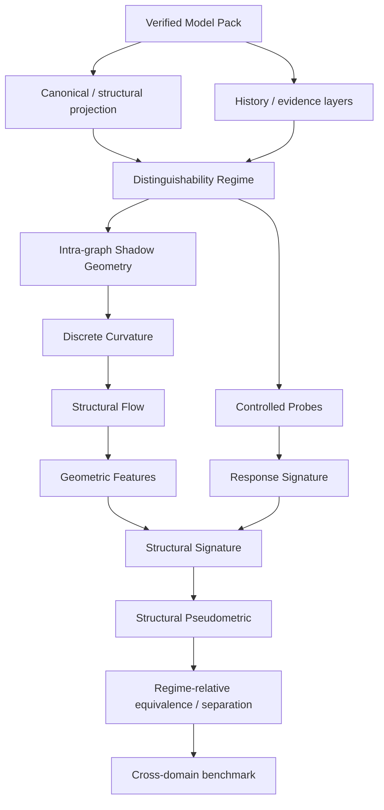
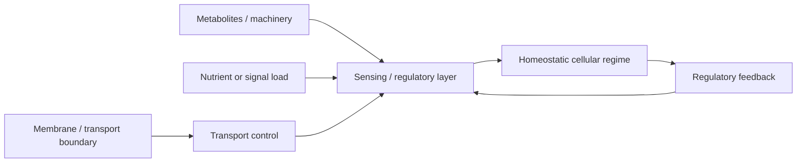
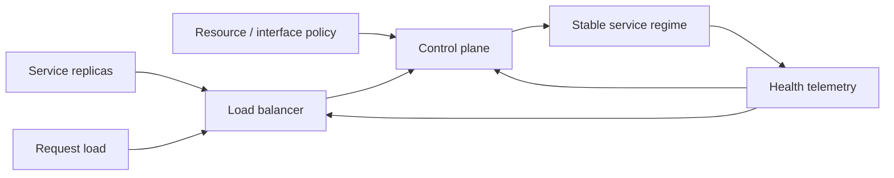
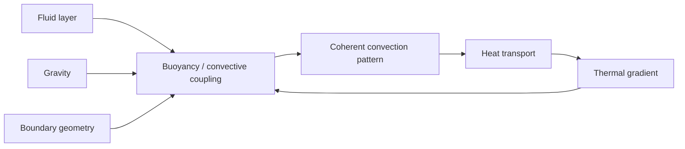
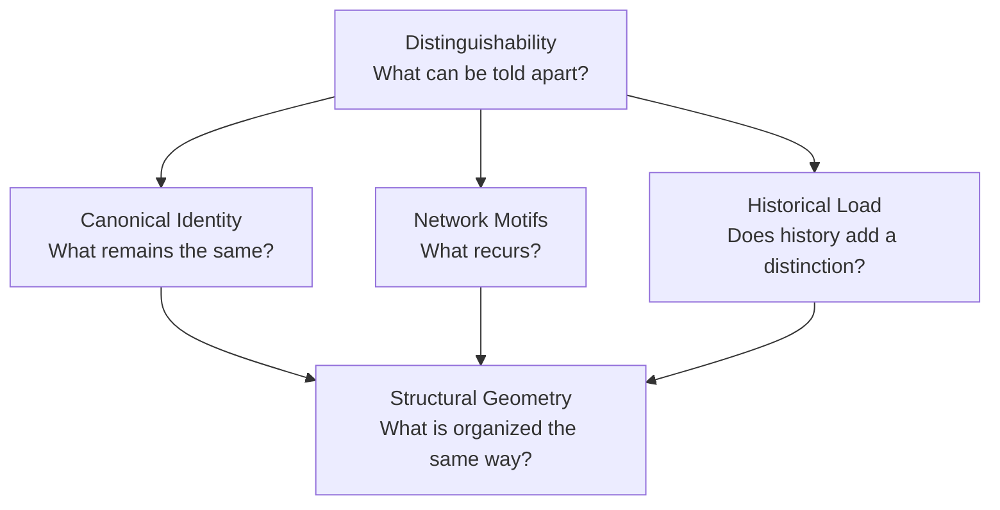

# Onto2D Structural Geometry — Revised Research Completion and Website Integration Plan

## Distinguishability → Structural Geometry → Flow → Signatures → Cross-Domain Tests

**Project:** Onto2D / SOMA  
**Status:** Revised master implementation specification  
**Date:** 2026-09-06  
**Supersedes:** the previous `ONTO2D_STRUCTURAL_GEOMETRY_SITE_IMPLEMENTATION.md`  
**Amends:** `ONTO2D_STRUCTURAL_GEOMETRY_ROADMAP.md` without invalidating already implemented projection / curvature / flow work  
**Current reported implementation position:** Structural Geometry work is already partly implemented; the current milestone is completion of **Geometric / Structural Flow**.  
**Execution order:** finish and correct the research/analysis stack first; build the public Structural Geometry page only after the research gates in this document are satisfied.

---

# 1. Executive decision

The Structural Geometry direction remains valid, but the original roadmap was missing a more principled answer to one question:

> **Where should the geometry come from?**

The first roadmap correctly introduced:

```text
Verified Model Pack
      ↓
Structural Projection
      ↓
Shadow Metric
      ↓
Curvature
      ↓
Flow
      ↓
Topology / Structural Signature
      ↓
Cross-domain comparison
```

That architecture is still useful and the already implemented work should **not** be thrown away.

However, a purely hand-authored `StructuralMetricPolicy` leaves a scientific weakness. A reviewer can reasonably ask why a particular relation weight, necessity class, or typed edge should correspond to a particular geometric length.

The new observation about **distinguishability** gives Onto2D a stronger organizing principle:

```text
before identity     → say what can be distinguished
before recurrence   → say which differences matter
before history      → say which additional observations split a class
before geometry     → say how distinguishability can become graded distance
```

The revised program therefore adds a new analytical foundation:

```text
Distinguishability Regime
        ↓
Observations + controlled probes
        ↓
Response Signature
        ↓
Structural Pseudometric
        ↓
Comparative Geometry
```

This does **not** replace the existing graph curvature / flow pipeline. It creates a second, complementary geometric layer and eventually supplies a more principled source of distances for some analyses.

The new master architecture is therefore:



The most important change is conceptual:

> **Structural Geometry is no longer only “geometry attached to a graph.” It becomes the study of how declared distinctions, graph organization, perturbation response, curvature, flow, and persistent structure combine into reproducible structural signatures.**

---

# 2. What changes relative to the first Structural Geometry roadmap

The first roadmap should be treated as **v1**, not discarded. This document is the **v2 correction and continuation**.

## 2.1 Keep unchanged

The following decisions from v1 remain correct:

- the schema-v1 kernel remains unchanged;
- a verified Model Pack is immutable source input;
- geometry is a read-only **shadow representation**;
- layout coordinates are never scientific geometry;
- canonical `Weight`, `Necessity`, `DependencyType`, etc. are never mutated by flow;
- projection policy is explicit and versioned;
- Forman-Ricci is a useful inexpensive baseline;
- Ollivier-Ricci is a useful transport-based comparison / flow basis;
- structural flow evolves shadow state only;
- persistent directed topology is a later analytical layer;
- higher-order relations are introduced only when explicitly justified;
- cross-domain comparisons must beat strong baselines and null models;
- every result is bound to exact Model Pack identity and exact analysis policy;
- Perelman/Hamilton are methodological inspiration, not a theorem applied to Onto2D.

## 2.2 Modify

These v1 concepts need revision.

### Old

```text
StructuralMetricPolicy
    = primary source of structural geometry
```

### Revised

```text
MetricProvider
    ├── unit / connectivity baseline
    ├── typed / declared metric hypothesis
    ├── necessity / filtration-derived metric
    └── distinguishability-derived metric     ← new research target
```

`StructuralMetricPolicy` therefore remains useful, but it is no longer the philosophical foundation of the project. It becomes one metric-provider family among several.

## 2.3 Insert before cross-domain comparison

The first roadmap moved from flow/topology directly toward a `StructuralSignature` and cross-domain comparison. v2 inserts an explicit observation layer:

```text
DistinguishabilityRegime
        ↓
ProbeSet
        ↓
ResponseSignature
        ↓
StructuralPseudometric
```

This is necessary because “similar structure” is meaningless until the analysis states **which differences are observable and which are intentionally ignored**.

## 2.4 Split the word “geometry” into two different things

This distinction is now mandatory.

### A. Intra-graph geometry

Geometry **inside one projected graph**:

```text
nodes / edges
    ↓
edge lengths
    ↓
Forman / Ollivier curvature
    ↓
flow
```

This is what the existing implementation is already building.

### B. Inter-structure geometry

Geometry **between two graph fragments / states / models**:

```text
fragment A
fragment B
    ↓
allowed observations and probes
    ↓
response signatures
    ↓
pseudometric d(A,B)
```

These are not the same mathematical object. They may later inform each other, but they must not be conflated.

---

# 3. Why distinguishability is a legitimate Onto2D concept

This direction is not being invented solely because it sounds philosophically attractive.

The current Onto2D Level-0 graph already begins with:

```text
0.0 Field Distinguishability
        ↓
0.1 Temporal Distinction
0.2 Spatial Distinction
        ↓
later metric / dynamical structure
```

The current catalogue explicitly treats `Field Distinguishability` as a repeatable difference that does **not** yet presuppose metric space, physical time, or ordinary spatial coordinates. Temporal and spatial distinction are downstream of that condition.

This remains a methodological / foundational placeholder, not an empirically established physical law.

That distinction is crucial.

## 3.1 Correct claim

Onto2D may say:

> **Distinguishability is a candidate organizing primitive for Onto2D analyses.**

Or more operationally:

> **Before two structures can be declared identical, recurrent, historically different, or geometrically near, the analysis must specify which observations are allowed to distinguish them.**

## 3.2 Claims that must not be made

Do not claim:

- distinguishability is proven to be the fundamental origin of all emergence;
- physical space universally emerges from distinguishability;
- stereo vision validates Onto2D Level-0;
- Fisher-Rao geometry proves the Onto2D model;
- all domains share one universal distinguishability metric;
- zero structural distance means two scientific mechanisms are identical.

---

# 4. The useful connection to vision

The recent “How Vision Becomes Spatial” line of work is useful as an **independent explanatory example**, not as validation.

A stereo / spatial perception pipeline can be summarized as:

```text
raw signals
    ↓
features / contrasts become distinguishable
    ↓
correspondence across views
    ↓
disparity / relative difference
    ↓
spatial relation
    ↓
stable world representation
```

The useful structural analogy is:

```text
raw declared structure
    ↓
distinguishability regime
    ↓
relation / equivalence classes
    ↓
graded difference
    ↓
structural geometry
    ↓
stable structural signature
```

This is a strong public explanation for the future website because it makes the order intuitive:

> geometry is not necessarily the first representation; it can be derived only after meaningful distinctions exist.

It must remain an analogy of representational order.

---

# 5. External mathematical precedents that justify the revised direction

The program now has several distinct mathematical precedents. None of them should be treated as a proof of Onto2D.

## 5.1 Behavioural pseudometrics

Computer-science semantics already has a mature idea that is unusually close to the revised Onto2D problem:

```text
internal representations may differ
        ↓
observable behaviour may be equivalent
        ↓
distance 0 under a behavioural pseudometric
```

A **pseudometric** is preferable to an ordinary metric because different internal objects may legitimately have distance zero under a declared observation regime.

This is exactly the situation Onto2D wants to express:

```text
A != B as raw representations
but
A and B may be indistinguishable under regime R
```

This must **not** be converted into semantic identity.

Research anchor:

- Desharnais et al., *A behavioural pseudometric for probabilistic transition systems*, Theoretical Computer Science 331(1), 2005. DOI: `10.1016/j.tcs.2004.09.035`.

## 5.2 Information geometry

Information geometry gives a different but conceptually useful precedent:

```text
statistical distinguishability
        ↓
Fisher information
        ↓
Riemannian metric
```

The Fisher-Rao metric is a canonical measure of statistical distinguishability for families of probability distributions.

This is important because it demonstrates that the abstract route:

```text
distinguishability → metric → geometry
```

is mathematically serious.

However, Fisher-Rao is **not** the default Onto2D metric because Onto2D's primary graph is deterministic and typed rather than a statistical manifold.

Use Fisher/information geometry later only for analyses that genuinely provide probability distributions, uncertainty models, or empirical response distributions.

Research anchors:

- Amari, *Information Geometry*, International Statistical Review, 2021.
- Nielsen, *An Elementary Introduction to Information Geometry*, Entropy 2020.

## 5.3 Discrete Ricci curvature and flow

Ni et al. demonstrate that a network can be treated as a discrete geometric object, with Ollivier-Ricci curvature and Ricci flow used to expose community structure. Their work explicitly uses the Hamilton/Perelman geometric-decomposition analogy.

This supports the **intra-graph** part of the Onto2D program:

```text
graph → metric → curvature → flow → structural decomposition
```

Research anchor:

- Ni, Lin, Luo, Gao, *Community Detection on Networks with Ricci Flow*, Scientific Reports 9, 9984 (2019). DOI: `10.1038/s41598-019-46380-9`.

## 5.4 Geometry on an ontology graph

GeOKG is directly relevant because it computes Forman-Ricci curvature on the Gene Ontology graph and uses heterogeneous geometry as motivation for mixed-geometry embeddings.

This demonstrates that “curvature of an ontology graph” is not an inherently nonsensical construction.

Research anchor:

- Jeong et al., *GeOKG: geometry-aware knowledge graph embedding for Gene Ontology and genes*, Bioinformatics 41(4), 2025, btaf160. DOI: `10.1093/bioinformatics/btaf160`.

## 5.5 Topology / higher-order structure

Bailey's 2026 review is valuable because it frames complex-systems work as a representation problem and explicitly separates:

- graph structure;
- geometry;
- topology;
- higher-order relations;
- dynamics;
- multiscale persistence.

It also stresses representation dependence and the need for null models.

Research anchor:

- Mark M. Bailey, *Topology as a Language for Emergent Organization in Complex Systems: Multiscale Structure, Higher-Order Interactions, and Early Warning Signals*, arXiv:2603.25760v1, 2026.

---

# 6. Non-negotiable architecture boundary

The revised work still follows the strongest part of the original Onto2D architecture.

## 6.1 Kernel stays closed

Do not add distinguishability, curvature, flow, or pseudometric operations to `@onto2d/kernel` merely because they are conceptually foundational.

“Foundational to analysis” is not the same thing as “kernel primitive.”

## 6.2 Verified Model Pack is immutable source

Every analysis starts from an exact verified Model Pack.

No analysis may silently rewrite:

- node identity;
- typed relation semantics;
- canonical `Weight`;
- `Necessity`;
- `DependencyType`;
- `InteractionModes`;
- `CausalDirections`;
- evidence fields;
- history/provenance fields.

## 6.3 All derived state is explicit

Derived state must live in analysis artifacts:

```text
projection
metric / pseudometric
curvature
flow
probe response
signature
comparison
```

Every layer has its own version and hash.

## 6.4 Epistemic uncertainty remains separate from mechanistic distance

A low-confidence relation is not automatically a long geometric edge.

Keep separate:

```text
mechanism geometry
observation geometry
epistemic support
```

They may be compared, but never silently collapsed.

---

# 7. Migration rule for the work already implemented

Because implementation is already approaching / completing **Geometric Flow**, do **not** restart from zero.

The migration strategy is:

```text
freeze current results
        ↓
finish deterministic flow baseline
        ↓
insert distinguishability contracts around the existing pipeline
        ↓
add response/pseudometric layer
        ↓
re-run the same baselines
```

## 7.1 Before changing architecture, freeze the current baseline

Create a baseline snapshot from the current implementation:

- exact projection artifact;
- current metric artifact(s);
- Forman curvature fixture outputs;
- Ollivier/reference outputs if already present;
- current flow trajectories;
- convergence diagnostics;
- source Model Pack hashes;
- all current tests.

Purpose:

> distinguish architectural cleanup from algorithmic regression.

## 7.2 Finish the current flow implementation

Do not stop flow work halfway to redesign everything.

Finish the current baseline with these minimum guarantees:

- source graph immutable;
- shadow lengths only;
- deterministic iteration order;
- deterministic normalization;
- finite iteration limit;
- explicit convergence criterion;
- no NaN / Infinity propagation;
- exact parameter block in artifact;
- trajectory hash or deterministic frame hashes;
- synthetic bridge / cluster fixture;
- published network-Ricci-flow-style reproduction where practical.

## 7.3 Then retrofit the metric interface

The old interface concept:

```ts
StructuralMetricPolicy
```

should evolve into something closer to:

```ts
interface StructuralMetricProvider {
  id: string;
  version: string;
  kind:
    | "unit"
    | "declared-typed"
    | "filtration-derived"
    | "response-derived";

  build(projection: StructuralProjection, context: MetricContext): ShadowMetric;
}
```

Existing unit / weight / necessity work becomes provider implementations rather than being deleted.

## 7.4 Backward-compatible provider mapping

```text
old unit metric
    → unit-v1 provider

old contribution-derived metric
    → declared-weight-v1 experimental provider

old necessity handling
    → necessity-filtration-v1

new distinguishability-derived geometry
    → response-derived-v1 later
```

This is the main mechanism that prevents wasted implementation work.

---

# 8. Revised core concept: `DistinguishabilityRegime`

A structural comparison is incomplete unless it states what the observer is permitted to inspect.

Define a versioned analysis contract.

```ts
interface DistinguishabilityRegime {
  id: string;
  version: string;

  projectionPolicy: string;
  canonicalizationPolicy: string;

  observables: ObservationSpec[];
  invarianceProbes: ProbeSpec[];
  responseProbes: ProbeSpec[];

  missingnessPolicy: "strict-indeterminate" | "partial-with-coverage";
  aggregationPolicy: string;
}
```

## 8.1 The three comparison outcomes

Do not return `true/false`.

```ts
type DistinguishabilityStatus =
  | "indistinguishable-under-regime"
  | "distinguishable-under-regime"
  | "indeterminate";
```

### Why `indeterminate` is mandatory

If structure B lacks history evidence, then:

```text
A and B are not distinguishable from available history
```

must **not** become:

```text
A and B are history-equivalent
```

No data is not equality.

## 8.2 Regime identity is part of the result

Never display:

```text
A ≈ B
```

without the regime.

Use:

```text
A and B are indistinguishable under topology-only-v1
A and B are distinguishable under typed-relations-v1
history-aware-v1: indeterminate
```

---

# 9. Observation regimes to implement first

Do not begin with a universal regime. Begin with a small finite family.

## 9.1 `canonical-structure-v1`

Observes:

- canonical node / edge identity after allowed relabeling;
- direction;
- declared structural edges;
- no domain labels.

Purpose:

> baseline exact structural equivalence.

## 9.2 `topology-only-v1`

Observes:

- adjacency;
- direction if explicitly selected;
- connectedness / SCC structure;
- cycles;
- reachability.

Ignores:

- domain vocabulary;
- dependency type;
- necessity;
- scientific status.

Purpose:

> determine what raw topology alone can distinguish.

## 9.3 `typed-relations-v1`

Adds:

- dependency type;
- interaction mode;
- ontological role;
- necessity class;
- causal direction.

Purpose:

> determine whether typed semantics split a topology-equivalent class.

## 9.4 `history-aware-v1`

Adds only available / admissible history observations.

Purpose:

> test whether history splits an otherwise indistinguishable present-state class.

This regime should reuse the epistemic discipline already established by History Matters / History Atlas.

## 9.5 `perturbation-response-v1`

Does not merely inspect the graph. It performs a finite, frozen set of controlled perturbations and records response.

Purpose:

> create the first behaviour-like signature suitable for a structural pseudometric.

---

# 10. Split probes into invariance probes and response probes

This separation prevents circular evaluation.

## 10.1 Invariance probes

These are transformations that the analysis is expected to ignore under a declared regime.

Examples:

- reorder serialization;
- canonical relabeling;
- change presentation coordinates;
- reorder independent records;
- split an explicitly transparent presentation node;
- collapse an explicitly transparent chain where the policy permits it.

Expected:

```text
structural result unchanged
```

## 10.2 Response probes

These are meaningful perturbations intended to reveal organization.

Examples:

- remove one necessary parent;
- remove one enabling parent;
- remove a feedback edge;
- reverse a directed relation;
- remove a constraint/boundary relation;
- ablate one redundant support path;
- remove history;
- remove one member of an explicitly reviewed higher-order relation;
- isolate a bottleneck edge;
- collapse a local subgraph under an explicitly declared abstraction.

Expected response is **not predefined globally**. It is measured.

---

# 11. `ResponseSignature`

For a graph fragment `G`, apply the frozen probe set and record only declared observables.

Conceptual contract:

```ts
interface ResponseSignature {
  regimeId: string;
  regimeVersion: string;
  fragmentHash: string;
  probeSetHash: string;

  outcomes: ProbeOutcome[];
  coverage: number;
  diagnostics: string[];
}
```

A probe outcome may include:

```ts
interface ProbeOutcome {
  probeId: string;
  status: "observed" | "indeterminate" | "rejected";

  observables?: {
    admissibilityChanged?: boolean;
    canonicalIdentityChanged?: boolean;
    reachableNodeDelta?: number;
    componentDelta?: number;
    sccDelta?: number;
    cycleProfileDelta?: number[];
    motifDelta?: Record<string, number>;
  };
}
```

Do **not** initially include every possible geometric metric. Keep a graph-native v0 signature first.

---

# 12. Build signatures in layers, not one magic vector

The original roadmap moved quickly toward one `StructuralSignature`. v2 should explicitly version layers.

## 12.1 `ResponseSignature-v0`

Contains only:

- structural / typed graph response;
- reachability;
- SCC/cycle effects;
- closure/admissibility effects where defined;
- motif changes;
- evidence coverage.

Purpose:

> strong non-geometric baseline.

## 12.2 `GeometricSignature-v1`

Adds:

- Forman curvature distribution summary;
- Ollivier curvature summary where available;
- extreme-edge identities relative to projection;
- flow convergence profile;
- normalized flow trajectory features;
- stable bottleneck / boundary events.

Purpose:

> test whether geometry adds information beyond graph response.

## 12.3 `DirectedTopologySignature-v2`

Adds later:

- path-homology / directed persistence features;
- directed flag-complex persistence where justified;
- filtration stability.

## 12.4 `HigherOrderSignature-v3`

Adds only for explicit higher-order cases:

- reviewed hyperedge / cell observables;
- higher-order curvature / persistence;
- pairwise-vs-higher-order comparison.

Do not ship one global scalar until all layers have calibration and null distributions.

---

# 13. Why the comparison object is a pseudometric

A normal metric requires:

```text
d(A,B) = 0  ⇒  A = B
```

Onto2D explicitly wants a weaker possibility:

```text
A != B internally
but
A and B are observationally indistinguishable under regime R
```

Therefore the correct first target is a **structural pseudometric**.

```ts
interface StructuralPseudometricResult {
  policyId: string;
  policyVersion: string;
  regimeId: string;

  distance: number | null;
  coverage: number;
  status: DistinguishabilityStatus;
  components: DistanceComponent[];
}
```

## 13.1 Baseline distance

The first implementation should be intentionally simple and auditable.

For comparable finite probe outcomes:

```text
component mismatch = 0 if equal
component mismatch = 1 if different
```

For normalized numeric quantities:

```text
component distance = declared normalized absolute difference
```

Then:

```text
d(A,B) = weighted mean of declared comparable components
```

Initial weights should be:

- equal by preregistered probe family;
- or explicitly declared in the benchmark.

Do not learn weights from the same benchmark used to claim success.

## 13.2 Missingness policy

Default:

```text
mandatory probe indeterminate
        ↓
overall distance = null
```

Optional exploratory mode may report:

```text
partial distance + coverage
```

but must never silently impute missing components.

---

# 14. Relationship to Canonical Identity, Motifs, and History

The distinguishability concept is valuable because it unifies the existing research directions without replacing them.

## 14.1 Canonical Identity

Question:

> Which representation differences should not create a different structural identity?

Interpretation:

```text
raw representation
     ↓ canonicalization
quotient by allowed representation differences
```

Canonical Identity is therefore the strongest exact equivalence mechanism in the stack.

A zero pseudometric distance must never silently replace canonical identity.

## 14.2 Network Motifs

Question:

> After identity / distinction rules are fixed, which local structural classes recur?

Motif analysis contributes:

- local structural class;
- recurrence counts;
- null-model enrichment;
- response to edge ablation.

Motifs become one part of `ResponseSignature` / `StructuralSignature`, not a subordinate implementation detail.

## 14.3 Historical Load / History Matters

Question:

> Does adding history make two present states distinguishable?

This can be formulated cleanly:

```text
present-only regime:
A ~ B

present + history regime:
A !~ B
```

That is a strong conceptual connection, but the actual history semantics remain governed by the existing History model and evidence rules.

## 14.4 Structural Geometry

Question:

> How are distinctions organized, and do apparently different structures occupy nearby regions of a declared structural space?

Structural Geometry therefore becomes the synthesis layer:

```text
Canonical Identity  → exact invariance
Motifs              → recurrent local structure
History             → distinctions added by path
Geometry / Flow     → organization of local structure
Pseudometric        → graded comparison across structures
```

---

# 15. Revised view of intra-graph Structural Geometry

The work already implemented remains a valid analysis of **one projected graph**.

```text
StructuralProjection
        ↓
StructuralMetricProvider
        ↓
ShadowMetric
        ↓
Curvature
        ↓
Flow
        ↓
GeometricSignature
```

## 15.1 Projection remains mandatory

Keep the conservative first projection:

```text
native directed graph
+ reviewed source-parent relations
+ no UI coordinates
+ no inferred hyperedges
+ no learned embedding
```

A projection hash remains part of every artifact.

## 15.2 Metric providers remain hypotheses

Keep the following baselines:

### `unit-v1`

```text
length(edge) = 1
```

Essential connectivity-only baseline.

### `necessity-filtration-v1`

Prefer nested relation inclusion over arbitrary category-to-number conversion:

```text
G0 necessary
G1 + enabling
G2 + contextual
G3 + optional
```

### `declared-weight-v1`

Keep only as experimental because current `Weight` is local contribution, not automatically globally calibrated length.

### `typed-multiplex-v1`

Keep different relation types as separate views/channels rather than scalarizing them too early.

### `response-derived-v1`

**New, later.** Derive local distances from how neighborhoods / fragments differ under a declared probe regime.

This is the first candidate metric provider that directly realizes:

```text
distinguishability → local distance → geometry
```

Do not block current flow implementation on this provider.

---

# 16. Curvature: keep the current plan

## 16.1 Forman-Ricci remains the first cheap baseline

Use it for:

- per-edge structural descriptors;
- deterministic full-model scans;
- synthetic fixture validation;
- initial extreme-edge discovery;
- typed / level / necessity comparisons.

Interpretation remains conservative:

> curvature is a structural observable under a declared projection and metric policy.

It is not “strength of emergence.”

## 16.2 Ollivier-Ricci remains the transport-based comparison

Use it when local neighborhood transport matters and as the main research basis for discrete network flow where appropriate.

Keep:

- bounded requests;
- exact policy identity;
- independent reference implementation;
- caching by projection + metric + parameters.

---

# 17. Finish Geometric / Structural Flow now

This is the immediate implementation milestone.

## 17.1 Flow contract

The flow evolves only shadow metric state:

```ts
interface StructuralFlowState {
  iteration: number;
  edgeLengths: Float64Array;
  curvatureSummary: CurvatureSummary;
  normalizationState: NormalizationState;
  convergence: FlowConvergenceState;
}
```

## 17.2 Required deterministic properties

- stable edge ordering;
- stable floating-point operation ordering where feasible;
- no hidden randomization;
- fixed normalization rule;
- fixed curvature parameters;
- fixed max iteration count;
- fixed convergence tolerance;
- explicit non-convergence result;
- explicit numerical failure result;
- source graph remains unchanged.

## 17.3 Flow artifact

Minimum fields:

```json
{
  "flowPolicy": {
    "id": "...",
    "version": "...",
    "curvatureMethod": "...",
    "stepSize": 0,
    "normalization": "...",
    "maxIterations": 0,
    "tolerance": 0
  },
  "initialMetricHash": "...",
  "frames": [],
  "converged": false,
  "stopReason": "...",
  "finalMetricHash": "..."
}
```

## 17.4 Do not call analytical cuts “Perelman surgery”

If the flow detects or cuts extreme bridge edges, use names such as:

```text
flow boundary
flow cut
threshold partition
structural decomposition event
```

Only describe Perelman as methodological inspiration.

## 17.5 Flow validation gate

Before interpreting Onto2D's flow:

1. path / cycle / clique / star fixtures behave predictably;
2. two dense clusters joined by a bridge expose the bridge under the selected curvature/flow method;
3. deterministic replay is exact within the declared numerical policy;
4. a published or independently implemented network-Ricci-flow reference is reproduced on a bounded fixture;
5. the unit-metric baseline is retained.

---

# 18. What changes immediately after flow is complete

Do **not** jump directly from flow to pretty cross-domain signatures.

The next implementation milestone becomes distinguishability.

```text
FLOW COMPLETE
      ↓
DistinguishabilityRegime contracts
      ↓
finite probe runner
      ↓
ResponseSignature-v0
      ↓
StructuralPseudometric-v0
      ↓
compare against geometry-free baselines
```

Only then continue with persistence / higher-order / combined signatures.

---

# 19. A critical scientific test: does geometry add anything?

The revised plan must explicitly allow Structural Geometry to fail.

Create two comparison pipelines.

## Pipeline A — non-geometric baseline

```text
projection
    ↓
canonical / typed graph observables
    ↓
probe responses
    ↓
ResponseSignature-v0
    ↓
pseudometric
```

## Pipeline B — geometric extension

```text
projection
    ↓
curvature + flow
    ↓
GeometricSignature-v1
    ↓
combine with ResponseSignature-v0
    ↓
pseudometric
```

Primary question:

> **Does Pipeline B separate known structural positives and negatives better, or more robustly, than Pipeline A?**

If not, curvature/flow may remain a useful visualization / decomposition tool but should not be promoted as the basis of cross-domain equivalence.

This is a much stronger falsification criterion than the original roadmap.

---

# 20. Direction-sensitive topology remains after distinguishability baseline

The original roadmap correctly identified direction-sensitive persistent topology as important.

Keep it, but implement it only after `ResponseSignature-v0` exists.

Evaluate:

1. persistent path homology;
2. persistent homology on directed flag complexes.

Candidate filtrations:

- necessity inclusion;
- flow edge length;
- curvature threshold;
- response-derived local distance later.

Gate:

> topology must add information beyond directed graph/motif baselines on controls specifically designed to differ in direction-sensitive structure.

---

# 21. Higher-order relations remain explicit-only

Do not infer:

```text
A → X
B → X
C → X
```

as:

```text
{A,B,C} → X
```

unless the case declares irreducible joint dependence.

The later higher-order pilot should compare:

```text
pairwise graph
vs
explicit hypergraph
vs
simplicial representation only where downward closure is justified
```

The scientific gate remains:

> the higher-order representation must change a known inference or preserve information that the pairwise representation provably loses in the selected case.

---

# 22. Four-domain cross-domain demonstrator — keep it, but change how it is used

The four explanatory domains remain useful:

1. **Biological** — homeostatic cellular regime;
2. **Technological** — orchestrated service regime;
3. **Physical** — driven convection pattern;
4. **Social** — institutional role stabilization.

But they should no longer be introduced as four pretty variants of one hand-drawn graph.

The revised experiment is:

```text
four independently represented domain fragments
        ↓
freeze observations / role mapping / probes first
        ↓
run the same abstract probe families
        ↓
compare response + geometric signatures
        ↓
ask whether a candidate structural family is recovered
```

## 22.1 Candidate family

Keep the explanatory label:

> **Constrained feedback stabilization**

Abstract ingredients:

```text
resources / substrate
        +
driver / demand
        +
constraint / boundary
        ↓
integration / coupling
        ↓
stabilized regime
        ↺ feedback
```

This is a **candidate family**, not a universal motif.

---

# 23. Biological candidate

## Homeostatic cellular regime

Native explanatory structure should be slightly more detailed than the abstract family.



Candidate abstract roles:

| Role | Biological interpretation |
|---|---|
| resources | metabolites + cellular machinery |
| driver | nutrient / signal load |
| constraint | membrane / transport limits |
| integration | sensing + metabolic regulation |
| state | homeostatic cellular regime |
| feedback | regulatory feedback |

Potential response probes:

- remove transport constraint;
- remove feedback;
- remove signal driver;
- ablate one redundant regulatory path;
- split / collapse a transparent regulatory intermediate.

Boundary:

> not a claim that all cellular homeostasis has this topology or that it is equivalent to another domain.

---

# 24. Technological candidate

## Orchestrated service regime

Use a native structure that is not graph-isomorphic to the biological fragment.



Candidate abstract roles:

| Role | Technological interpretation |
|---|---|
| resources | service replicas / compute |
| driver | request load |
| constraint | resource + interface policy |
| integration | load balancer + control plane |
| state | stable service regime |
| feedback | health / load telemetry |

Potential response probes:

- remove resource policy;
- remove health feedback;
- bypass control plane;
- remove one replica path;
- merge controller and load-balancer representation.

Boundary:

> structural comparison does not imply biological equivalence.

---

# 25. Physical candidate

## Driven convection pattern

Rayleigh–Bénard-style convection remains a useful concrete inspiration because pattern formation depends on driver, material, boundary conditions, and transport feedback.



Candidate abstract roles:

| Role | Physical interpretation |
|---|---|
| resources | fluid layer |
| driver | thermal gradient |
| constraint | gravity + boundary geometry |
| integration | buoyancy / convective coupling |
| state | convection pattern |
| feedback | heat transport modifies local gradient |

Potential response probes:

- remove thermal gradient;
- change / remove boundary constraint;
- remove gravity term in the declared model;
- break heat-transport feedback;
- aggregate gravity + boundary conditions into one presentation constraint only in a declared abstraction regime.

Boundary:

> source-lock a real physical model before using this as scientific benchmark data.

---

# 26. Social candidate

## Institutional role stabilization

Use a native graph with explicit separation between rules and enforcement.


Candidate abstract roles:

| Role | Social interpretation |
|---|---|
| resources | participants + resources |
| driver | task / demand pressure |
| constraint | institutional rules |
| integration | coordination mechanism |
| state | stable role allocation |
| feedback | enforcement / reputation |

Potential response probes:

- remove institutional rule;
- remove enforcement feedback;
- remove demand pressure;
- separate or merge coordination roles under a declared abstraction;
- reverse enforcement direction as a negative control.

Boundary:

> no claim that social institutions obey the same equations or causal mechanism as cells, software, or fluids.

---

# 27. The four domains are not validation goldens

This remains one of the strongest decisions from the previous site plan.

There is no independent theorem saying these four mechanisms are structurally equivalent.

Therefore:

```text
four domains = candidate analogues / explanatory research set
```

not:

```text
four domains = positive ground truth
```

The first validation goldens must be synthetic or independently labeled.

---

# 28. Revised synthetic control suite

## 28.1 Positive invariance controls

Start from one base graph and apply transformations explicitly declared to preserve structural identity under a regime:

- node relabeling;
- serialization reorder;
- UI/layout change;
- transparent chain split;
- transparent chain collapse;
- semantically neutral presentation node;
- bounded perturbation of shadow metric only;
- equivalent canonical Model Pack encoding where supported.

Expected:

```text
indistinguishable-under-regime
small / zero pseudometric distance
stable signature
```

## 28.2 Negative structural controls

Mutate the base mechanism by:

- delete feedback;
- change convergence into branching;
- reverse one critical causal direction;
- move the constraint after the stabilized state;
- remove the bottleneck;
- disconnect one required parent;
- replace explicit joint dependence by independent dyads;
- introduce / remove a directed cycle;
- alter history while keeping present graph fixed in a history-aware regime.

Expected:

```text
distinguishable-under-regime
non-zero distance
signature change
```

## 28.3 Hard negatives

Create graphs that preserve:

- node count;
- degree sequence;
- motif histogram where possible;
- number of typed relation categories;

but change organization.

Purpose:

> prevent the new method from winning only because of trivial graph statistics.

---

# 29. Baselines that Structural Geometry must beat

Do not compare the method only to itself.

At minimum benchmark against:

1. exact graph isomorphism / canonical identity where applicable;
2. topology-only graph summary;
3. typed motif histogram;
4. degree / SCC / reachability features;
5. spectral graph features;
6. role-projected graph comparison;
7. a standard graph-kernel / Weisfeiler-Lehman-style baseline in the offline research suite if practical;
8. response-signature pseudometric **without geometry**.

Structural Geometry is valuable only if curvature/flow/persistence adds something beyond these baselines.

---

# 30. Revised falsifiable hypotheses

The v1 hypotheses should be replaced by a more layered set.

## H0 — Distinguishability regime matters

Changing the declared observation regime should split / merge equivalence classes in predictable controlled cases.

Failure condition:

> regime changes do not change any result even when observables were constructed to differ.

## H1 — Response signatures capture nontrivial structure

Controlled positive transformations stay close while structural mutations separate under `ResponseSignature-v0`.

Failure condition:

> response signatures cannot outperform trivial graph statistics.

## H2 — Curvature contains added local information

Curvature identifies bridge / neighborhood organization not already captured by degree alone.

Failure condition:

> curvature adds no discriminative or robust signal over simple baselines.

## H3 — Flow creates stable decomposition information

Flow trajectories / stable extreme regions improve discrimination or decomposition relative to static curvature alone.

Failure condition:

> flow is numerically unstable, parameter-dominated, or adds no information.

## H4 — Geometry improves comparison

`GeometricSignature-v1 + ResponseSignature-v0` performs better than `ResponseSignature-v0` alone on preregistered positives / negatives.

Failure condition:

> geometry gives no measurable improvement.

## H5 — Direction-sensitive persistence adds information

Directed topology separates controls that undirected or motif baselines merge.

Failure condition:

> persistence is redundant with simpler features.

## H6 — Explicit higher-order semantics add information

Known irreducible higher-order cases differ from pairwise projections in a reproducible, scientifically meaningful way.

Failure condition:

> higher-order representation changes nothing beyond complexity.

## H7 — Cross-domain analogues exist

Some independently sourced domain fragments become nearer under structural signatures than constrained nulls / hard negatives.

Failure condition:

> candidate cross-domain pairs are not more similar than matched nulls.

## H8 — Results are representation-robust

Declared invariant transformations leave the conclusion stable.

Failure condition:

> similarity is mainly an artifact of serialization, arbitrary projection, metric policy, or layout.

---

# 31. Revised artifact model

The old Structural Geometry artifact must be extended rather than replaced.

```json
{
  "schemaVersion": 2,
  "analysis": "structural-geometry",
  "analysisVersion": "0.2.0",

  "model": {
    "id": "...",
    "version": "...",
    "rootHash": "...",
    "manifestHash": "..."
  },

  "projection": {
    "policyId": "causal-directed-v1",
    "policyVersion": "...",
    "hash": "..."
  },

  "distinguishability": {
    "regimeId": "typed-relations-v1",
    "regimeVersion": "...",
    "probeSetHash": "..."
  },

  "metric": {
    "providerId": "unit-v1",
    "providerVersion": "...",
    "origin": "declared-baseline",
    "hash": "..."
  },

  "curvature": {
    "method": "...",
    "implementationVersion": "...",
    "valuesHash": "..."
  },

  "flow": {
    "policyId": "...",
    "policyVersion": "...",
    "trajectoryHash": "...",
    "converged": false,
    "stopReason": "..."
  },

  "responseSignature": {
    "policyId": "...",
    "hash": "...",
    "coverage": 1.0
  },

  "geometricSignature": {
    "policyId": "...",
    "hash": "..."
  },

  "claim": {
    "status": "method-under-test"
  }
}
```

Fields not yet implemented may be absent only when schema version explicitly permits them. Do not fill them with fake zero values.

---

# 32. Comparison artifact

Cross-structure comparison should have a separate artifact.

```json
{
  "schemaVersion": 1,
  "analysis": "structural-comparison",
  "leftArtifactHash": "...",
  "rightArtifactHash": "...",
  "regime": {
    "id": "perturbation-response-v1",
    "version": "..."
  },
  "pseudometric": {
    "id": "response-l1-v1",
    "version": "...",
    "distance": 0.17,
    "coverage": 1.0,
    "status": "indistinguishable-under-regime"
  },
  "components": [],
  "diagnostics": []
}
```

Important:

`distance = 0` is not exported as `sameMechanism: true`.

---

# 33. Recommended package architecture

Do not fragment the repository into many packages too early.

Keep one analysis package while the research API is unstable:

```text
packages/
  structural-geometry-analysis/
    src/
      projection/
      distinguishability/
      probes/
      metrics/
      curvature/
      flow/
      signatures/
      comparison/
      artifacts/
    test/
```

Conceptual modules:

```text
projection
    StructuralProjectionPolicy

distinguishability
    DistinguishabilityRegime
    ObservationSpec

probes
    ProbeSet
    ProbeRunner

metrics
    StructuralMetricProvider
    StructuralPseudometricPolicy

curvature
    Forman
    Ollivier adapter

flow
    StructuralFlowPolicy
    StructuralFlowRunner

signatures
    ResponseSignature
    GeometricSignature
    DirectedTopologySignature

comparison
    compareStructuralArtifacts()
```

The package registers with the engine similarly to `@onto2d/canonical-identity-analysis`.

---

# 34. Engine integration

Conceptual public use:

```js
const onto = await Onto2D.create({
  models: [verifiedPack],
  analyses: [structuralGeometryAnalysis]
});

const geometry = await onto.analyze("structural-geometry", request);

const comparison = await onto.analyze("structural-comparison", {
  left: geometryA,
  right: geometryB,
  regime: "perturbation-response-v1"
});
```

The engine does not infer a default scientific regime silently.

If `regime` is omitted in a comparison request, fail explicitly unless the specific analysis API has a documented baseline default.

---

# 35. External numerical boundary

Keep expensive / research-grade algorithms outside the kernel.

Candidates:

- exact Ollivier transport;
- persistent path homology;
- directed persistence;
- higher-order curvature;
- large graph-kernel baselines;
- statistical/information-geometric experiments.

Use the existing scientific-adapter pattern:

```text
normalized request
    ↓
external implementation identity
    ↓
frozen response
    ↓
validation
```

Only port an algorithm into JS when it has proved useful and the deterministic contract is clear.

---

# 36. Revised implementation sequence

This sequence supersedes Stage 0–10 from the first roadmap.

The already implemented work is **not** reset. The sequence is designed to merge into the current state.

## Stage R0 — Freeze current implementation baseline

**Do now, before architectural retrofit.**

Deliverables:

- current projection goldens;
- current curvature goldens;
- current flow fixtures / partially completed flow behavior;
- exact artifact examples;
- current performance snapshot.

Gate:

> future refactors can prove they did not silently change existing behavior.

---

## Stage R1 — Complete deterministic Geometric Flow

**Current milestone.**

Deliverables:

- flow runner;
- normalization;
- convergence contract;
- flow frames / trajectory hash;
- synthetic bridge fixture;
- independent reference reproduction where feasible.

Gate:

> deterministic replay and known synthetic structural behavior.

---

## Stage R2 — Refactor metric policy into metric providers

Deliverables:

- `StructuralMetricProvider` interface;
- `unit-v1` provider;
- current metric providers wrapped without semantic change;
- provider identity in artifacts.

Gate:

> old fixtures reproduce exactly through the new provider interface.

---

## Stage R3 — Add Distinguishability contracts

Deliverables:

- `DistinguishabilityRegime` schema;
- tri-state comparison semantics;
- `canonical-structure-v1`;
- `topology-only-v1`;
- `typed-relations-v1`.

Gate:

> synthetic pairs merge/split exactly as the regimes declare.

---

## Stage R4 — Add finite Probe Runner

Deliverables:

- invariance probe registry;
- response probe registry;
- deterministic graph-transform sandbox;
- source-preserving provenance for every probe.

Gate:

> probes never mutate canonical input and reproduce byte-identical outcomes.

---

## Stage R5 — `ResponseSignature-v0`

Deliverables:

- graph-native response features;
- strict missingness / indeterminate handling;
- coverage diagnostics.

Gate:

> positive invariance controls stay stable; negative structural controls separate.

---

## Stage R6 — `StructuralPseudometric-v0`

Deliverables:

- simple auditable component distance;
- no learned weights;
- strict missingness policy;
- comparison artifact.

Gate:

> distance behavior matches synthetic controls and obeys pseudometric checks where mathematically applicable.

---

## Stage R7 — `GeometricSignature-v1`

Deliverables:

- curvature summary;
- flow trajectory summary;
- bottleneck / decomposition events;
- stability under invariant transformations.

Gate:

> benchmark geometry against `ResponseSignature-v0` alone.

This is the first decisive test of whether the current curvature/flow implementation provides added scientific value.

---

## Stage R8 — Direction-sensitive persistence

Deliverables:

- bounded persistent path homology or equivalent directed method;
- direction-sensitive fixtures;
- persistence features added separately, not mixed into one scalar.

Gate:

> added information beyond graph/motif/geometry baselines.

---

## Stage R9 — Explicit higher-order pilot

Deliverables:

- one reviewed higher-order case;
- pairwise / hypergraph / simplicial comparison;
- source semantics that justify the representation.

Gate:

> higher-order representation changes a known inference.

---

## Stage R10 — Cross-domain candidate set

Deliverables:

- biological fragment;
- technological fragment;
- physical fragment;
- social fragment;
- frozen abstract-role mapping;
- frozen probe mapping;
- source references for real scientific versions.

Gate:

> no manual tuning after seeing similarity scores.

---

## Stage R11 — Blinded / null-model benchmark

Deliverables:

- positive controls;
- hard negatives;
- constrained null graphs;
- graph baselines;
- response-only baseline;
- geometry-extended result.

Gate:

> only proceed to public similarity claims if geometry/persistence adds robust signal.

---

## Stage R12 — Website / Structural Geometry Lab

Only now build the public research page as a result-bearing interface rather than a speculative animation.

---

# 37. Revised task list

The original `SG-001 … SG-013` task list should be extended/replaced by the following working sequence.

## Immediate — finish existing work

- **SG2-001** Freeze current Structural Geometry artifact fixtures.
- **SG2-002** Finish deterministic Structural Flow.
- **SG2-003** Add flow convergence / failure contract.
- **SG2-004** Reproduce bounded reference flow behavior.
- **SG2-005** Wrap current metrics behind `StructuralMetricProvider`.

## Distinguishability foundation

- **SG2-010** Define `DistinguishabilityRegime` JSON Schema.
- **SG2-011** Implement `canonical-structure-v1`.
- **SG2-012** Implement `topology-only-v1`.
- **SG2-013** Implement `typed-relations-v1`.
- **SG2-014** Implement tri-state result semantics.
- **SG2-015** Define strict missingness policy.

## Probe / response layer

- **SG2-020** Implement immutable probe sandbox.
- **SG2-021** Add serialization/relabel invariance probes.
- **SG2-022** Add feedback / constraint / direction response probes.
- **SG2-023** Add history-ablation hook without duplicating History semantics.
- **SG2-024** Implement `ResponseSignature-v0`.

## Comparative geometry

- **SG2-030** Implement `StructuralPseudometric-v0`.
- **SG2-031** Add pseudometric property tests.
- **SG2-032** Add coverage / indeterminate diagnostics.
- **SG2-033** Add comparison artifact schema.

## Geometric added-value test

- **SG2-040** Implement `GeometricSignature-v1` from existing curvature/flow.
- **SG2-041** Benchmark response-only vs response+geometry.
- **SG2-042** Sensitivity analysis across metric providers.
- **SG2-043** Parameter-robustness analysis for flow.

## Later research

- **SG2-050** Persistent path homology spike.
- **SG2-051** Higher-order reviewed pilot.
- **SG2-052** Build four real domain fragments.
- **SG2-053** Freeze cross-domain role/probe mapping.
- **SG2-054** Null-model / hard-negative generator.
- **SG2-055** Blinded cross-domain benchmark.

## Website only after research gate

- **SGWEB2-001** Redesign homepage research map.
- **SGWEB2-002** Build Structural Geometry Lab shell.
- **SGWEB2-003** Add observation-regime selector.
- **SGWEB2-004** Add Graph → Geometry → Flow → Signature interaction.
- **SGWEB2-005** Add four-domain candidate comparison.
- **SGWEB2-006** Add falsification/results panel.
- **SGWEB2-007** Add vision/distinguishability explanatory bridge.

---

# 38. Definition of Done before website work begins

Do not start the major public Structural Geometry page merely because the animation is ready.

The research stack is ready for website implementation when all of the following are true:

- [ ] current projection / curvature / flow baselines are frozen;
- [ ] flow is deterministic and has explicit convergence/failure semantics;
- [ ] old metric implementations are behind explicit providers;
- [ ] at least three distinguishability regimes are implemented;
- [ ] `indeterminate` is preserved correctly;
- [ ] invariant and response probes are deterministic;
- [ ] `ResponseSignature-v0` exists;
- [ ] `StructuralPseudometric-v0` exists;
- [ ] synthetic positives / negatives pass their expected regime tests;
- [ ] `GeometricSignature-v1` exists;
- [ ] there is at least one result comparing response-only against response+geometry;
- [ ] analysis artifacts bind exact model + projection + regime + metric + curvature + flow identities;
- [ ] no cross-domain equivalence claim is required for the site to function.

A public **method-under-test** page may be built slightly earlier, but it must not show illustrative numbers as measured similarity.

---

# 39. Website architecture after the research stack is ready

The previous site plan is still directionally correct, but the homepage research map should now include **Distinguishability as the foundation**.

The conceptual map becomes:



A compact homepage rendering:

```text
                    DISTINGUISHABILITY
                   What can be told apart?
                           │
          ┌────────────────┼────────────────┐
          ▼                ▼                ▼

 Canonical Identity   Network Motifs   Historical Load
 What remains         What recurs?     Does history add
 the same?                             a distinction?

          └────────────────┬────────────────┘
                           ▼

                 Structural Geometry
          What is organized the same way?
```

This is stronger than the previous homepage map because it gives the project an analytical foundation rather than only a synthesis target.

---

# 40. Homepage content rule

Do not turn Distinguishability into a fifth equal card.

It should be a **foundation strip / root node** above the research map.

Suggested copy:

> **DISTINGUISHABILITY / FOUNDATION**  
> Before identity, relation, history, or geometry, a model must state what can be told apart.

Boundary tooltip / note:

> This is an analytical principle and a Level-0 methodological motif, not a claim that distinguishability is an empirically established fundamental law of nature.

Below it:

```text
Canonical Identity
What remains the same?

Network Motifs
What recurs?

Historical Load
Does the path add a distinction?

Structural Geometry
What is organized the same way?
```

---

# 41. Structural Geometry Lab — revised main interaction

The previous four-stage UI remains excellent:

```text
GRAPH → GEOMETRY → FLOW → SIGNATURE
```

But it now needs a control **before** those views:

```text
OBSERVATION REGIME
[ topology ] [ typed relations ] [ history ] [ perturbation response ]
```

The same pair of fragments may produce different conclusions under different regimes.

Example public result:

```text
Topology
INDISTINGUISHABLE UNDER THIS REGIME

Typed relations
DISTINGUISHABLE

History
INDETERMINATE — insufficient history evidence

Perturbation response
DISTANCE 0.14
Candidate structural similarity
```

Never show one unconditional “similarity score.”

---

# 42. Structural Geometry Lab — main visual

Keep one selected fragment / pair through the entire analysis.

```text
1 DECLARED GRAPH
      ↓
2 SHADOW GEOMETRY
      ↓
3 STRUCTURAL FLOW
      ↓
4 RESPONSE + GEOMETRIC SIGNATURE
      ↓
5 REGIME-RELATIVE COMPARISON
```

The source panel must remain frozen while derived panels change.

### Declared graph

Show exact source relations.

### Shadow geometry

Show derived lengths / curvature with policy identity.

### Flow

Animate only derived metric state.

### Signature

Show feature components, not a magic percentage.

### Comparison

Show regime, distance, coverage, and indeterminate components.

---

# 43. Future four-domain website section

Use title:

> **Different vocabulary. Candidate common organization.**

Show four native graphs:

```text
BIOLOGICAL      TECHNOLOGICAL
PHYSICAL        SOCIAL
```

Controls:

```text
Vocabulary   [native] [abstract roles]
View         [graph] [response] [geometry] [flow]
Regime       [topology] [typed] [perturbation]
```

Mandatory boundary:

> Similarity is evaluated under a declared analysis regime. Candidate proximity does not establish semantic identity, common cause, shared equations, or common history.

Do not show cross-domain PASS/FAIL until source-locked cases and a benchmark exist.

---

# 44. Vision / “How Vision Becomes Spatial” as a public bridge

The vision article can become a small explanatory section after the visitor already understands Distinguishability.

Suggested title:

> **Why start with distinction?**

Visual:

```text
VISION
features → correspondence → disparity → geometry

ONTO2D
observables → distinguishability → distance → structural geometry
```

Suggested copy:

> Spatial vision offers an intuitive example of representational order: a system cannot infer a spatial relation between signals it cannot first distinguish and compare. Onto2D tests a related analytical idea for structures, without claiming that the two mechanisms are physically or mathematically identical.

This is narrative support, not evidence for the Onto2D foundational theory.

---

# 45. Hamilton / Perelman section remains, but moves later

Keep it only after the user understands the actual algorithm.

```text
Hamilton / Perelman                  Onto2D
complicated manifold                 typed structural graph
        ↓                                    ↓
geometry                                shadow geometry
        ↓                                    ↓
Ricci flow                              controlled graph flow
        ↓                                    ↓
decomposition                           structural observables
```

Mandatory label:

> **Analogy of strategy — not the same mathematics.**

The new Distinguishability layer makes this section better because Onto2D can now answer the question that was previously weak:

> “What justified the chosen geometry?”

Answer:

> first, conservative metric baselines; later, geometry derived from explicit observation / response regimes and validated against controls.

---

# 46. What the public page must say about Bailey

Bailey remains a contextual research anchor, not validation.

Suggested page message:

> Complex-systems analysis often requires topology, geometry, higher-order structure, and dynamics to be treated as complementary representations. Onto2D Structural Geometry tests one explicit, replayable way to combine those layers over a typed model.

Do not say:

> Bailey confirms Onto2D.

---

# 47. Final research architecture

The full target system is now:

```text
                         VERIFIED MODEL PACK
                                │
                                ▼
                         CANONICALIZATION
                                │
                                ▼
                       STRUCTURAL PROJECTION
                                │
                                ▼
                    DISTINGUISHABILITY REGIME
                      /                     \
                     /                       \
                    ▼                         ▼
            INTRA-GRAPH GEOMETRY          PROBE RUNNER
                    │                         │
            metric providers                 │
                    │                         ▼
                    ▼                  RESPONSE SIGNATURE
                 CURVATURE                    │
                    │                         │
                    ▼                         │
                   FLOW                       │
                    │                         │
                    ▼                         │
             GEOMETRIC SIGNATURE ─────────────┘
                    │
                    ▼
            STRUCTURAL PSEUDOMETRIC
                    │
                    ▼
       REGIME-RELATIVE STRUCTURAL COMPARISON
                    │
          ┌─────────┼──────────┐
          ▼         ▼          ▼
       MOTIFS    HISTORY    DIRECTED TOPOLOGY
          \         │          /
           \        │         /
            └───────┼────────┘
                    ▼
           CROSS-DOMAIN BENCHMARK
                    │
                    ▼
        CANDIDATE STRUCTURAL FAMILIES
```

This is intentionally not a single linear “universal emergence algorithm.” It is a set of explicit analyses with shared contracts.

---

# 48. Final scientific positioning

The strongest defensible long-term question is no longer merely:

> Can Onto2D graphs be assigned useful curvature?

It becomes:

> **Can a typed structural model define explicit observation regimes under which different realizations produce reproducible response, geometric, and topological signatures — and do those signatures identify structural families across domains better than simpler graph baselines?**

That question is:

- technically implementable;
- falsifiable;
- compatible with the current Onto2D architecture;
- compatible with the work already completed on curvature and flow;
- not dependent on a metaphysical claim about distinguishability;
- strong enough to justify a serious research program if the benchmarks succeed.

---

# 49. Immediate next action

Because the implementation is currently at **Geometric Flow**, the correct next sequence is:

```text
NOW
1. Finish flow.
2. Freeze flow goldens and artifacts.
3. Refactor metric handling behind MetricProvider.

NEXT
4. Implement DistinguishabilityRegime.
5. Implement ProbeRunner.
6. Build ResponseSignature-v0.
7. Build StructuralPseudometric-v0.

THEN
8. Convert existing curvature + flow output into GeometricSignature-v1.
9. Test whether geometry adds value over response-only baselines.
10. Only then continue to persistent topology / higher-order / cross-domain benchmark.

LAST
11. Build the public Structural Geometry Lab and redesign the homepage.
```

This ordering preserves the work already done and fixes the scientific weakness before it becomes part of the public story.

---

# 50. References and research anchors

## Onto2D

- Onto2D repository: <https://github.com/DenBraun/Onto2D>
- Public site: <https://denbraun.github.io/Onto2D/>
- Current foundational traceability: `docs/FOUNDATIONAL_PAPER_ANALYSIS.md`
- Current Level-0 source catalogue: `references/level-0.json`

## Distinguishability / behavioural distance

- Desharnais, Gupta, Jagadeesan, Panangaden. *A behavioural pseudometric for probabilistic transition systems*. Theoretical Computer Science 331(1), 2005. <https://doi.org/10.1016/j.tcs.2004.09.035>
- Amari. *Information Geometry*. International Statistical Review, 2021. <https://doi.org/10.1111/insr.12464>
- Nielsen. *An Elementary Introduction to Information Geometry*. Entropy 22(10), 2020. <https://pmc.ncbi.nlm.nih.gov/articles/PMC7650632/>

## Discrete curvature / flow

- Ni, Lin, Luo, Gao. *Community Detection on Networks with Ricci Flow*. Scientific Reports 9, 9984 (2019). <https://doi.org/10.1038/s41598-019-46380-9>

## Ontology / knowledge-graph geometry

- Jeong et al. *GeOKG: geometry-aware knowledge graph embedding for Gene Ontology and genes*. Bioinformatics 41(4), 2025, btaf160. <https://doi.org/10.1093/bioinformatics/btaf160>

## Emergence / topology / higher-order systems

- Bailey. *Topology as a Language for Emergent Organization in Complex Systems: Multiscale Structure, Higher-Order Interactions, and Early Warning Signals*. arXiv:2603.25760v1, 2026. <https://arxiv.org/abs/2603.25760>

---

# 51. Supersession note

This document intentionally combines two previously separate concerns:

1. correction / continuation of the original Structural Geometry research roadmap;
2. website integration and public explanation.

The execution order is now explicit:

```text
research stack first
        ↓
validated / falsifiable comparison machinery
        ↓
website second
```

The previous website-only plan should no longer be used as the implementation order. Its visual ideas remain useful, but its `Graph → Geometry → Flow → Signature` story must be upgraded with:

```text
Distinguishability Regime
Response Signature
Structural Pseudometric
Indeterminate state
```

before the page is considered scientifically aligned with the revised Onto2D program.
