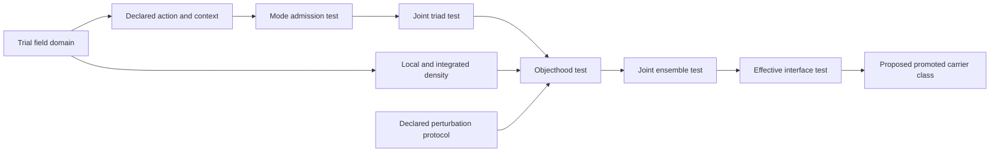

# Level-0 relation review — 2026-09-12

All 84 incoming parent assertions in the historical Level-0 catalogue have an
internal disposition. Fourteen become scoped definition dependencies, thirteen
map to joint rule specifications, and fifty-seven are withheld from the active
graph. This is a completed internal assessment of this level, with unresolved
scientific obligations. It is not independent validation of the theory.

The complete decisions are in [edge-reviews.json](edge-reviews.json). Every
record preserves the exact historical parent object and JSON pointer, explains
the endpoint-specific decision, identifies any replacement, gives an
alternative and states what would justify revisiting it. The corresponding
claim and citations are available in the Studio Inspector of the target
concept and any replacement rule. At release `2026.09.12`, 887 assertions
outside this level remained pending. The subsequent
[retinal pilot](RETINAL_REVIEW.md) reviews twenty-two of them; current
[migration.json](migration.json) records 865 pending assertions.

## Method and evidence

The [review policy](relation-review-policy.json) was written before these
per-edge dispositions, after exposure to the existing catalogue, its cycles,
the foundation review and the numerical case. This was neither blind review
nor preregistration. No cycle count, curvature or connectivity target selected
the outcomes. The original graph was an intuitive draft; this procedure is
a new reconstruction method, not a recovered historical algorithm.

The [topology manuscript](../topology-of-arising.pdf) supplies the definitions
and construction proposals under review. Its full 36-page text and all ten
archived drafts were previously inspected; the second, 101-page manuscript
received only the [declared targeted review](../../models/causal-emergence/reconstruction/source-review.json).
An absence of a derivation in this reviewed material is an unresolved
obligation, not proof that no derivation exists elsewhere.

The [foundation findings and executable witnesses](../../models/causal-emergence/reconstruction/README.md#mathematical-findings-that-change-representation)
limit particular implications: the source operator sign is inconsistent,
stationarity need not be a minimum, and balanced modes need not localize.
The [portable numerical case](../../cases/level-0-oscillator/REVIEW.md) found no
candidate passing every objecthood gate within its declared model and search.
That result neither validates nor generally falsifies the theory.

The external publications remain methodological sources. A forward macro map
and consistent interventions follow the scope of
[Rubenstein et al.](https://arxiv.org/abs/1707.00819v1); they do not establish
that CRT promotion satisfies that contract. Predictive minimality in
[Shalizi and Crutchfield](https://arxiv.org/abs/cond-mat/9907176v2) is distinct
from a minimum number of physical components. No new empirical publication
is claimed to confirm these Level-0 proposals.

## Structural changes

The active `2026.09.12` source has 28 concepts, six joint rule specifications
and 129 scoped claims. Its compiled graph has 34 nodes and 42 descriptive
connections: 25 rule incidences, 14 retained definition dependencies and three
new definition dependencies. None asserts an observed physical causal effect.

- **Trial domain before solution admission.** The old `0.4 -> 0.5` assertion
  conflated a solution with the argument of its variational functional. A new
  trial-field domain supplies the action argument and the local-density
  definition. Admitted oscillatory modes remain conditional outputs of
  `R-mode`. See manuscript pages 5–6 and 13.
- **Density before objecthood.** Local density is defined on a complex field;
  its integral additionally needs support, measure and existence. Neither
  requires an already localized triad merely to be defined. The new
  `local-density -> integrated-density` relation states integration, without
  claiming conservation, localization or object identity. See pages 18–22.
- **Joint admission instead of flat generation.** Triadic closure, localized
  objecthood, persistent ensembles and effective carrier promotion require
  distinct tests. The thirteen legacy replacements point to specifications,
  not equivalent physical events. The objecthood rule now explicitly takes a
  perturbation protocol as context; this does not establish the legacy
  deformation mechanism. See pages 16–22 and 27–35.
- **Separate analytic and premetric contexts.** The primitive directional
  definitions use the premetric context. Mode equations and the chosen-frame
  selection expression use an assumed analytic frame. No retained relation
  claims that unrestricted possibility generates the hyperbolic metric.
- **Do not infer a mechanism from a branch name.** The directional extension,
  scalar-parameter shortcuts, discrete-spectrum shortcuts and cohort-selection
  shortcuts lack the required operators or implication tests. Their reviewed
  assertions remain in the ledger with specific alternatives and revisiting
  conditions; hypothesis nodes remain visible with their limitations.

The following diagram summarizes the order of specifications. Each gate also
has the additional joint inputs and conditions stored in [graph.json](graph.json).
Arrows express specification dependencies, not completed physical formation.

Structural geometry can compare explicitly typed alternative specifications,
or candidate instance graphs after a physical rule application contract is
defined. It cannot supply a missing mechanism simply by optimizing the shape
of this diagram. Minimality needs a declared candidate universe, target
predicate, allowed removals and search scope. A construction experiment must
test those semantics as well as any geometry it measures. No geometric
optimization or new physical generator is implemented by this release.

## Quantitative assertions and lifecycle

All 84 original weights, necessity labels and carrier thresholds remain in
the ledger. None is carried into the canonical graph as a calibrated physical
quantity. This avoids giving arbitrary numbers apparent support by normalizing
them. The separately declared multiplicities in rule specifications, such as
three distinct modes under the stated triad predicate, retain their own scope.

The carrier dictionary identifies 16 group/type mismatches among these edges.
Another 44 edges use dependency type `11`, which means **Transport** in the
historical dictionary, without a specified transport mechanism in the reviewed
assertion. These are contextual audit findings, not 44 demonstrations that
physical transport is impossible. Both flags are checked against each exact
parent object and [the original dictionaries](../descriptions.json).

Legacy `arising`, `maintenance` and `modulation` roles are preserved separately
from adopted semantic kind. For example, `0.21 -> 0.8` becomes a perturbative
persistence test requirement rather than an assertion of a maintenance
process. A lifecycle label does not establish a mechanism or feedback loop.

## Coverage by historical target

Each incoming assertion belongs to its target's review. These counts cover
all 84 assertions exactly once; they are not scores of scientific truth.
`0.15` has no historical parents. New trial-domain and integration definitions
are additional source decisions and are not counted as retained legacy edges.

| Historical target | Scoped descriptions | Joint rule replacements | Withheld |
|---|---:|---:|---:|
| `0.0` | 1 | 0 | 0 |
| `0.1` | 2 | 0 | 0 |
| `0.2` | 2 | 0 | 0 |
| `0.3` | 0 | 0 | 3 |
| `0.4` | 0 | 3 | 2 |
| `0.5` | 2 | 0 | 3 |
| `0.6` | 0 | 2 | 1 |
| `0.7` | 0 | 0 | 3 |
| `0.8` | 0 | 3 | 4 |
| `0.9` | 1 | 0 | 1 |
| `0.10` | 0 | 2 | 5 |
| `0.11` | 1 | 0 | 1 |
| `0.12` | 1 | 1 | 3 |
| `0.13` | 0 | 2 | 4 |
| `0.14` | 0 | 0 | 5 |
| `0.15` | 0 | 0 | 0 |
| `0.16` | 1 | 0 | 0 |
| `0.17` | 0 | 0 | 2 |
| `0.18` | 2 | 0 | 2 |
| `0.19` | 1 | 0 | 2 |
| `0.20` | 0 | 0 | 4 |
| `0.21` | 0 | 0 | 5 |
| `0.22` | 0 | 0 | 3 |
| `0.23` | 0 | 0 | 4 |
| **Total** | **14** | **13** | **57** |

## Remaining work

1. Reconcile the source action, operator and dispersion convention; specify
   independent fields and a bounded interaction model for objecthood tests.
2. Operationalize the distinction domain, compensation functional, spectral
   hypothesis and cohort-selection functional. Revisit the recorded edges
   using their explicit conditions, retaining unsuccessful alternatives.
3. Obtain independent scientific review and test carrier admission and
   promotion in their declared domains. No CRT instance currently passes all
   gates in the bound numerical case.
4. Continue the [optical/retinal pilot and remaining review batches](../../docs/ROADMAP.md#active-sequence-references-and-derived-graph)
   with claim-specific primary publications and mechanism tests. There are
   225 legacy nodes and 887 incoming assertions outside Level 0 in this
   review's original scope; the subsequent pilot reduces the pending totals
   to 219 nodes and 865 assertions.

The [source guide](README.md) gives the current and historical replay commands.
The first canonical release and the original 249-node catalogue retain their
exact identities; the current source does not overwrite their evidence.
